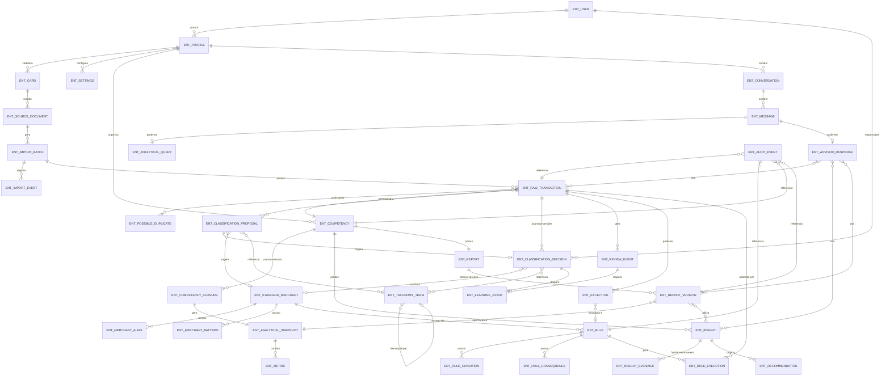

> **Nota de leitura.** Este documento assume a blueprint `AURÓR · Hub Financeira — V0.1` como fonte de verdade conceitual. Nada aqui a contradiz; o trabalho é de aprofundamento estrutural, não de reinterpretação. Onde uma decisão de produto não estava explícita na blueprint, isso é sinalizado como `[DECISÃO NECESSÁRIA]`, `[HIPÓTESE]` ou `[RISCO]` — nunca tratado como fato.
>
> Convenção de identificadores: `SCR-` telas, `JRN-` jornadas, `ENT-` entidades, `EPC-` épicos, `HST-` histórias, `PKG-` pacotes para Claude Code, `RUL-` regras de integridade.

---

# 1. Premissas interpretadas

1. **Usuária única no MVP, arquitetura multi-perfil desde o início.** Victoria é a primeira e única usuária ativa, mas o modelo de dados já carrega `ENT-USER` e `ENT-PROFILE` como entidades separadas desde a Fase 0, para que "família", "múltiplos perfis" e "empresa" sejam extensões de cardinalidade e não reescritas de esquema. `[DECISÃO NECESSÁRIA]` confirmar que o MVP roda single-tenant (um único usuário autenticado) mesmo com o schema multi-usuário pronto.
2. **Fatura de cartão de crédito é o documento de origem primário do MVP.** A blueprint fala genericamente em "documentos financeiros", mas todos os exemplos (fatura, cartão, vencimento, parcela) são de cartão de crédito. Assumo que contas correntes, boletos e outras origens ficam fora do MVP e entram como novo tipo de `ENT-SOURCE-DOCUMENT` em fase futura.
3. **"Competência" é definida pelo mês de ocorrência do gasto, não pelo vencimento da fatura.** Isso está explícito na blueprint (4.3) e tem implicação estrutural forte: uma única fatura pode gerar lançamentos em duas competências diferentes (ex.: fatura fecha dia 10, gastos entre 11/mai e 10/jun caem parte em maio, parte em junho, dependendo de como o emissor define o corte). `[DECISÃO NECESSÁRIA]` regra exata de corte de competência por bandeira/banco — inicialmente assumida como configurável por cartão.
4. **"Confirmar" na Caixa de Entrada é a unidade atômica de trabalho do usuário**, não "revisar a competência inteira". A revisão em lote é uma otimização sobre essa unidade, não um fluxo paralelo.
5. **IA aqui significa um conjunto de responsabilidades distintas (extração, classificação, triagem, aprendizagem, análise, narrativa, consulta), não um único modelo genérico.** Cada uma tem contrato de entrada/saída próprio e pode ser implementada com técnicas diferentes (regras determinísticas, heurísticas estatísticas, LLM) sem afetar as demais.
6. **"Agente" é responsabilidade arquitetural, não processo.** No MVP, todos os agentes podem viver como módulos dentro de um único backend, chamados sincronamente ou via fila simples. Nenhum requisito de microsserviço, orquestração distribuída ou múltiplos modelos é assumido.
7. **Regras não substituem revisão — elas reduzem a frequência dela.** Uma regra nunca confirma um lançamento sem deixar rastro de que foi a regra (e não o usuário) que decidiu.
8. **Relatório é artefato imutável por versão.** Reabrir uma competência não apaga relatórios antigos; gera nova versão de snapshot e, se solicitado, novo relatório.
9. **O motor analítico (Fase 6) depende de dados de pelo menos 2–3 competências fechadas para produzir comparações históricas confiáveis.** `[HIPÓTESE]` — na prática, os primeiros relatórios terão menos comparação histórica e mais descrição do período corrente.
10. **Claude Code será o executor da implementação, não o definidor da arquitetura.** Este documento existe para eliminar ambiguidade antes que qualquer prompt de implementação seja escrito.

---

# 2. Decisões arquiteturais

| # | Decisão | Justificativa | Alternativa descartada |
|---|---|---|---|
| D1 | Três camadas de dados rígidas: **Fato** (imutável) → **Inteligência** (versionada, proposta ou decidida) → **Experiência** (projeções de leitura) | É o núcleo da blueprint (seção 3); qualquer atalho aqui compromete auditabilidade | Guardar classificação como coluna do lançamento bruto |
| D2 | Lançamento bruto nunca é editado, apenas lido. Toda correção gera uma nova `ENT-CLASSIFICATION-DECISION` | Preserva rastreabilidade total e permite reprocessar classificação sem perder o fato original | Update in-place do lançamento |
| D3 | Fornecedor tem duas entidades: `ENT-RAW-MERCHANT` (string como veio do banco) e `ENT-STANDARD-MERCHANT` (entidade canônica) ligadas por `ENT-MERCHANT-ALIAS` | Blueprint 4.5 exige isso explicitamente (DL UBER / UBER TRIP / UBER *PENDING → mesmo fornecedor) | Normalizar fornecedor com regex direto no lançamento |
| D4 | Taxonomia é tabela de vocabulário controlado; nenhum campo de classificação aceita string livre nas dimensões estruturadas (categoria, subcategoria, objetivo, natureza, essencialidade, tipo de ocorrência) | Blueprint 4.6 — "nenhuma categoria pode nascer livremente" | Enum hardcoded no código |
| D5 | Contexto é campo híbrido: até 1 `ENT-CONTEXT-TAG` estruturada + texto livre + entidades relacionadas (opcional) | Blueprint reconhece que contexto não é totalmente rígido | Contexto 100% estruturado (rígido demais) ou 100% texto livre (não analisável) |
| D6 | Regra nunca aplica automaticamente sem produzir um `ENT-RULE-EXECUTION` auditável, mesmo quando o resultado é "confirmação automática" | Blueprint 4.7 — "toda aplicação deve ser explicável" | Regras "silenciosas" que só aparecem no log de sistema |
| D7 | Confiança é modelada por dimensão (categoria, subcategoria, objetivo, natureza, essencialidade, tipo de ocorrência, fornecedor), não como número único | Permite à Caixa de Entrada exigir revisão só da dimensão fraca, não do lançamento inteiro | Confiança única agregada |
| D8 | Competência fechada gera `ENT-COMPETENCY-CLOSURE` versionado; reabertura cria nova versão de fechamento, nunca sobrescreve | Blueprint 4.3 e seção 11.5 | Fechamento como campo booleano mutável |
| D9 | Relatório aponta sempre para um `ENT-ANALYTICAL-SNAPSHOT` imutável, nunca recalcula em tempo real a partir do estado atual | Garante que relatório antigo continue coerente mesmo após reaberturas | Relatório como view dinâmica sobre dados atuais |
| D10 | MVP roda com persistência real desde a Fase 1 (banco relacional), não com dados mockados em memória | O valor do produto depende de auditabilidade e histórico reais desde o primeiro upload; simular persistência criaria retrabalho | Protótipo em memória/JSON local |
| D11 | Toda "sugestão de IA" carrega `versão do modelo/motor` e `justificativa textual` como campos obrigatórios, nunca opcionais | Requisito transversal da blueprint (seção 6, 7, "IA sempre apresentará justificativa e confiança") | Justificativa como campo opcional preenchido "quando possível" |
| D12 | Consultor (Fase 8) só é implementado depois que existir massa mínima de competências fechadas, insights e relatórios — nunca antes | Sem substrato de dados, o Consultor viraria chatbot genérico, contradizendo o princípio central do produto | Implementar Consultor cedo com respostas genéricas de LLM |

---

# 3. Mapa de arquitetura de informação

## 3.1 Estrutura geral de navegação

```text
AURÓR · Hub Financeira
│
├── Navegação principal (persistente, sempre visível)
│   ├── Home                         (SCR-HOME-001)
│   ├── Caixa de Entrada             (SCR-INBOX-001)   ← badge com contagem pendente
│   ├── Competências                 (SCR-COMP-LIST-001)
│   ├── Acervo                       (SCR-ARCHIVE-001)
│   ├── Fornecedores                 (SCR-MERCH-LIST-001)
│   ├── Taxonomia                    (SCR-TAX-001)
│   ├── Motor de Regras              (SCR-RULES-001)
│   ├── Histórico                    (SCR-HISTORY-001)
│   ├── Relatórios                   (SCR-REPORT-LIST-001)
│   ├── Consultor                    (SCR-ADVISOR-001)
│   └── Configurações                (SCR-SETTINGS-001)
│
├── Navegação contextual (aparece dentro de uma área)
│   ├── Dentro de Competência → documentos, lotes, lançamentos, relatório, auditoria daquela competência
│   ├── Dentro de Fornecedor → aliases, regras vinculadas, histórico de decisões
│   ├── Dentro de Lançamento → drawer de detalhe (nunca navegação de página cheia)
│   └── Dentro de Relatório → versões anteriores, snapshot de origem
│
├── Painéis/drawers globais (sobrepõem, não substituem a tela)
│   ├── Drawer de Detalhe do Lançamento     (SCR-TXN-DETAIL-001)
│   ├── Drawer de Detalhe do Fornecedor     (SCR-MERCH-DETAIL-001)
│   ├── Painel de Auditoria/Histórico de Decisões (SCR-AUDIT-001)
│   └── Painel de Contexto Rápido (aberto a partir de qualquer cartão da Caixa de Entrada)
│
├── Modais (ação pontual, bloqueante, sempre com saída clara)
│   ├── Upload de Documento           (parte de SCR-UPLOAD-001)
│   ├── Confirmação de Fechamento de Competência
│   ├── Confirmação de Reabertura de Competência
│   ├── Criação/edição de Regra a partir de uma decisão
│   └── Registro de Exceção
│
└── Ações globais (acessíveis de qualquer tela, via ação primária fixa)
    ├── "Enviar documento" (sempre visível — entrada de novos dados nunca fica escondida)
    ├── Busca global (fornecedor, lançamento, competência)
    └── Atalho para Consultor (pergunta rápida sem sair do contexto atual)
```

## 3.2 Hierarquia entre áreas

| Nível | Área | Papel na jornada |
|---|---|---|
| 0 | Home | Ponto de entrada informativo. Nunca é onde o trabalho acontece — é onde o usuário decide para onde ir. |
| 1 | Caixa de Entrada | Área de trabalho principal. É onde a inteligência do sistema é validada por um humano. |
| 1 | Competências | Área de gestão de período. Orquestra o ciclo de vida (aberta → revisão → fechada → possivelmente reaberta). |
| 2 | Acervo | Área de exploração/consulta sobre dados já consolidados. Não é onde se decide, é onde se entende o que já foi decidido. |
| 2 | Fornecedores | Memória operacional. Suporta a Caixa de Entrada e a Taxonomia; raramente é destino primário de uma sessão. |
| 2 | Taxonomia | Governança de vocabulário. Acessada com pouca frequência, mas estruturalmente crítica. |
| 2 | Motor de Regras | Camada de automação controlada. Consequência das decisões tomadas na Caixa de Entrada, não ponto de partida. |
| 2 | Histórico | Leitura de longo prazo sobre tendência e comportamento. |
| 1 | Relatórios | Saída formal por competência. Consumida fora do fluxo operacional (compartilhável). |
| 1 | Consultor | Interface de consulta ad-hoc sobre tudo o que já existe. |
| 2 | Auditoria | Camada transversal de rastreabilidade, acessível a partir de qualquer entidade (lançamento, regra, relatório, competência). |
| 3 | Configurações | Manutenção do sistema (cartões, taxonomia inicial, preferências). Ponto de entrada único no onboarding, depois residual. |

A regra de navegação: **Home → indica; Caixa de Entrada → resolve; Competências → consolida; Acervo/Histórico → explica; Relatórios → comunica; Consultor → responde.**

---

# 4. Inventário completo de telas

Tabela-índice (detalhamento de cada uma logo abaixo):

| ID | Tela | Momento de acesso |
|---|---|---|
| SCR-ONBOARD-001 | Onboarding inicial | Primeiro acesso, antes de qualquer dado existir |
| SCR-SETUP-001 | Configuração inicial | Durante onboarding e sob demanda em Configurações |
| SCR-UPLOAD-001 | Envio de documentos | Sempre que há fatura nova |
| SCR-IMPORT-STATUS-001 | Acompanhamento da importação | Logo após upload, até conclusão do lote |
| SCR-IMPORT-VALIDATE-001 | Validação da extração | Quando o lote termina, antes de virar lançamentos "prontos" |
| SCR-IMPORT-DIVERGENCE-001 | Tratamento de divergências | Quando total extraído ≠ total declarado |
| SCR-INBOX-001 | Caixa de Entrada | Toda vez que há pendências de revisão |
| SCR-INBOX-REVIEW-001 | Revisão individual | Ao abrir um cartão da Caixa de Entrada |
| SCR-INBOX-BATCH-001 | Revisão em lote | Quando há grupo de itens semelhantes |
| SCR-TXN-DETAIL-001 | Detalhe do lançamento | A partir de Caixa de Entrada, Acervo, Fornecedor, Relatório |
| SCR-COMP-LIST-001 | Lista de competências | Navegação principal |
| SCR-COMP-DETAIL-001 | Detalhe da competência | A partir da lista, Home ou relatório |
| SCR-COMP-CLOSE-001 | Fechamento da competência | Quando competência está "pronta para fechamento" |
| SCR-COMP-REOPEN-001 | Reabertura de competência | Novo documento chega para período já fechado, ou usuário solicita |
| SCR-ARCHIVE-001 | Acervo | Navegação principal |
| SCR-MERCH-LIST-001 | Lista de fornecedores | Navegação principal |
| SCR-MERCH-DETAIL-001 | Detalhe do fornecedor | A partir da lista, de um lançamento, da Caixa de Entrada |
| SCR-TAX-001 | Taxonomia | Navegação principal / configuração |
| SCR-RULES-001 | Motor de regras | Navegação principal |
| SCR-RULES-DETAIL-001 | Detalhe/edição de regra | A partir da lista de regras ou de uma decisão da Caixa de Entrada |
| SCR-HISTORY-001 | Histórico | Navegação principal |
| SCR-REPORT-LIST-001 | Lista de relatórios | Navegação principal |
| SCR-REPORT-DETAIL-001 | Detalhe do relatório | A partir da lista, Home, ou fechamento de competência |
| SCR-ADVISOR-001 | Consultor conversacional | Navegação principal |
| SCR-SETTINGS-001 | Configurações | Navegação principal |
| SCR-AUDIT-001 | Auditoria e histórico de decisões | A partir de qualquer entidade (lançamento, regra, competência, relatório) |
| SCR-HOME-001 | Home | Primeira tela após login |

## 4.1 SCR-ONBOARD-001 — Onboarding inicial

- **Objetivo:** levar o usuário do zero absoluto até o primeiro upload de documento com o mínimo de fricção, sem pedir configuração que pode ser feita depois.
- **Contexto principal:** primeiro acesso, nenhum dado existente.
- **Dados exibidos:** nenhuma informação financeira; apenas explicação curta do modelo (fato → inteligência → decisão) e o que será pedido no setup.
- **Ações disponíveis:** iniciar configuração inicial; (opcional) pular para upload direto usando taxonomia padrão.
- **Estados:** não iniciado; em progresso; concluído.
- **Estado vazio:** é o próprio estado natural desta tela — não se aplica "vazio" como exceção.
- **Estado de erro:** nenhum (tela estática/informativa).
- **Navegação de entrada:** login inicial.
- **Navegação de saída:** SCR-SETUP-001.
- **Dependências:** nenhuma.
- **Impacto no sistema:** cria `ENT-USER` e `ENT-PROFILE` se ainda não existirem.

## 4.2 SCR-SETUP-001 — Configuração inicial

- **Objetivo:** registrar cartões/origens financeiras e revisar a taxonomia padrão antes do primeiro upload.
- **Contexto principal:** onboarding; revisitável em Configurações.
- **Dados exibidos:** lista de cartões cadastrados; taxonomia padrão (categorias, objetivos, naturezas, essencialidades, tipos de ocorrência) pré-carregada e editável.
- **Ações disponíveis:** adicionar cartão; editar cartão; ativar/desativar dimensão da taxonomia; ajustar rótulos padrão; avançar para upload.
- **Estados:** taxonomia padrão intacta; taxonomia customizada; nenhum cartão cadastrado (bloqueia avanço).
- **Estado vazio:** nenhum cartão cadastrado → CTA único "adicionar primeiro cartão".
- **Estado de erro:** dados de cartão inválidos (ex. sem instituição).
- **Filtros/ordenação:** não aplicável (lista curta).
- **Navegação de entrada:** SCR-ONBOARD-001; SCR-SETTINGS-001.
- **Navegação de saída:** SCR-UPLOAD-001.
- **Dependências:** `ENT-CARD`, `ENT-TAXONOMY-*`.
- **Impacto no sistema:** cria registros de `ENT-CARD` e ajusta `ENT-TAXONOMY-TERM` ativos.

## 4.3 SCR-UPLOAD-001 — Envio de documentos

- **Objetivo:** permitir envio de um ou mais PDFs de fatura, associando-os a cartão e (quando possível) período.
- **Contexto principal:** sempre que uma nova fatura está disponível; acessível de qualquer tela via ação global.
- **Dados exibidos:** lista de arquivos selecionados; cartão sugerido (por reconhecimento) ou a selecionar; status de upload por arquivo.
- **Ações disponíveis:** selecionar arquivo(s); associar/corrigir cartão; confirmar envio; cancelar.
- **Estados:** aguardando seleção; enviando; enviado (aguardando processamento); erro de envio.
- **Estado vazio:** nenhum arquivo selecionado (CTA de seleção).
- **Estado de carregamento:** barra de progresso por arquivo durante upload.
- **Estado de erro:** arquivo corrompido, formato inválido, ou documento duplicado (hash já existente) — ver JRN-IMPORT-DUPLICATE (variante de exceção).
- **Navegação de entrada:** ação global "Enviar documento"; SCR-SETUP-001 (primeiro envio); SCR-COMP-DETAIL-001 (upload direcionado a uma competência específica, ex. reabertura).
- **Navegação de saída:** SCR-IMPORT-STATUS-001.
- **Dependências:** `ENT-CARD` deve existir.
- **Impacto no sistema:** cria `ENT-SOURCE-DOCUMENT` e dispara `ENT-IMPORT-BATCH`.

## 4.4 SCR-IMPORT-STATUS-001 — Acompanhamento da importação

- **Objetivo:** dar visibilidade do progresso da extração sem exigir espera ativa (o usuário pode sair e voltar).
- **Contexto principal:** logo após envio, até o lote concluir.
- **Dados exibidos:** etapa atual (reconhecendo documento / extraindo / conciliando totais / concluído); tempo estimado; alertas preliminares.
- **Ações disponíveis:** cancelar importação (se ainda não concluída); ver log técnico (avançado); navegar para outra tela (processamento continua em background).
- **Estados:** reconhecendo; extraindo; conciliando; concluído sem divergência; concluído com divergência; falhou.
- **Estado de erro:** falha de extração (documento ilegível, formato não suportado pelo importador daquela instituição).
- **Navegação de entrada:** SCR-UPLOAD-001.
- **Navegação de saída:** concluído sem divergência → SCR-IMPORT-VALIDATE-001; concluído com divergência → SCR-IMPORT-DIVERGENCE-001; falhou → tela de erro com opção de reenvio.
- **Dependências:** `ENT-IMPORT-BATCH`, `ENT-IMPORT-EVENT`.
- **Impacto no sistema:** popula `ENT-RAW-TRANSACTION` conforme extração avança.

## 4.5 SCR-IMPORT-VALIDATE-001 — Validação da extração

- **Objetivo:** dar ao usuário uma checagem rápida "isso bate com a fatura?" antes de os lançamentos entrarem no fluxo normal de revisão.
- **Contexto principal:** logo após conclusão de um lote sem divergência de totais.
- **Dados exibidos:** total extraído vs. total declarado (coincidentes); quantidade de lançamentos extraídos; possíveis duplicidades detectadas; amostra de lançamentos.
- **Ações disponíveis:** confirmar validação (lançamentos seguem para Caixa de Entrada); marcar duplicidade suspeita para revisão manual; abrir documento original para conferência.
- **Estados:** aguardando confirmação; confirmado.
- **Estado vazio:** lote sem lançamentos extraídos (falha silenciosa de extração) → tratado como erro, não como vazio legítimo.
- **Navegação de entrada:** SCR-IMPORT-STATUS-001.
- **Navegação de saída:** SCR-INBOX-001 (lançamentos entram na fila de revisão).
- **Dependências:** `ENT-RAW-TRANSACTION`, `ENT-POSSIBLE-DUPLICATE`.
- **Impacto no sistema:** lançamentos passam de status "extraído" para "disponível para classificação".

## 4.6 SCR-IMPORT-DIVERGENCE-001 — Tratamento de divergências

- **Objetivo:** resolver o caso em que total extraído ≠ total declarado no documento, antes de prosseguir.
- **Contexto principal:** logo após a etapa de conciliação de totais falhar.
- **Dados exibidos:** total declarado; total extraído; diferença absoluta e percentual; lista de lançamentos extraídos (para conferência linha a linha); página/posição de origem de cada um (para checagem contra o PDF).
- **Ações disponíveis:** revisar lançamento a lançamento contra o PDF; adicionar lançamento faltante manualmente (com sinalização de origem manual); marcar divergência como aceitável e prosseguir; reenviar documento; abrir documento original lado a lado.
- **Estados:** divergência não resolvida; divergência resolvida (aceita); divergência resolvida (corrigida).
- **Estado de erro:** usuário não consegue reconciliar (ex. taxas/juros que o importador não captura) → aceitar divergência com justificativa registrada.
- **Navegação de entrada:** SCR-IMPORT-STATUS-001.
- **Navegação de saída:** SCR-INBOX-001, uma vez resolvida.
- **Dependências:** `ENT-IMPORT-BATCH.divergence`, `ENT-RAW-TRANSACTION`.
- **Impacto no sistema:** registra `ENT-IMPORT-EVENT` do tipo "divergência resolvida", com justificativa vinculada.

## 4.7 SCR-INBOX-001 — Caixa de Entrada

- **Objetivo:** centro operacional — todo lançamento que exige confirmação, correção ou contexto aparece aqui.
- **Contexto principal:** uso recorrente, potencialmente diário.
- **Dados exibidos:** fila de cartões (estrutura definida na blueprint 4.2: fornecedor original, fornecedor padronizado sugerido, data, valor, cartão, competência, parcela, classificação sugerida, contexto sugerido, confiança, justificativa, histórico semelhante).
- **Ações disponíveis:** confirmar; alterar; adicionar contexto; aplicar decisão a ocorrências semelhantes; marcar como exceção; revisar depois; abrir detalhe (SCR-TXN-DETAIL-001).
- **Estados:** fila com itens; fila vazia (zero pendências); fila filtrada sem resultado.
- **Estado vazio:** "Nenhuma pendência no momento" — reforça positivamente que o sistema está aprendendo (mostrar métrica de quanto a fila diminuiu vs. mês anterior).
- **Estado de carregamento:** skeleton dos cartões enquanto propostas de classificação são carregadas.
- **Estado de erro:** falha ao carregar proposta de um item específico → cartão exibido em modo "revisão manual sem sugestão".
- **Alertas:** conflito de regra; possível duplicidade; gasto extraordinário destacado visualmente.
- **Filtros:** por confiança; por valor; por fornecedor; por tipo de pendência (baixa confiança / fornecedor desconhecido / fornecedor ambíguo / duplicidade / valor incompatível / extraordinário / contexto necessário / regra conflitante / divergência / nova taxonomia sugerida).
- **Ordenações:** por confiança (menor primeiro); por valor (maior primeiro); por data; por fornecedor (agrupado, para viabilizar lote).
- **Navegação de entrada:** navegação principal; SCR-IMPORT-VALIDATE-001; SCR-COMP-DETAIL-001.
- **Navegação de saída:** SCR-INBOX-REVIEW-001 (item único); SCR-INBOX-BATCH-001 (grupo); SCR-TXN-DETAIL-001; SCR-MERCH-DETAIL-001 (a partir do fornecedor de um cartão); SCR-RULES-DETAIL-001 (ao criar regra a partir de uma decisão).
- **Dependências:** `ENT-CLASSIFICATION-PROPOSAL`, `ENT-CLASSIFICATION-DECISION`, `ENT-TRIAGE` (agente de triagem).
- **Impacto no sistema:** toda ação gera `ENT-REVIEW-EVENT` e potencialmente `ENT-CLASSIFICATION-DECISION`.

## 4.8 SCR-INBOX-REVIEW-001 — Revisão individual

- **Objetivo:** decidir um lançamento específico com contexto completo, sem precisar sair da Caixa de Entrada.
- **Contexto principal:** ao clicar/abrir um cartão específico da fila.
- **Dados exibidos:** todos os campos do cartão + painel expandido com histórico semelhante, regras aplicáveis, e alternativas de classificação sugeridas.
- **Ações disponíveis:** as mesmas da Caixa de Entrada, aplicadas a este item; navegação "próximo"/"anterior" dentro da fila sem retornar à lista.
- **Estados:** pendente; confirmado; corrigido; marcado como exceção; adiado ("revisar depois").
- **Estado de erro:** tentativa de confirmar com dimensão obrigatória ausente (ex. categoria não pode ficar em branco) → bloqueio com mensagem específica.
- **Navegação de entrada:** SCR-INBOX-001.
- **Navegação de saída:** próximo item da fila; volta a SCR-INBOX-001 quando fila esvazia; SCR-RULES-DETAIL-001 (criar regra); SCR-TAX-001 (quando surge sugestão de novo termo de taxonomia).
- **Dependências:** mesmas de SCR-INBOX-001, mais `ENT-EXCEPTION`.
- **Impacto no sistema:** grava `ENT-CLASSIFICATION-DECISION` versionada, apontando para a `ENT-CLASSIFICATION-PROPOSAL` anterior.

## 4.9 SCR-INBOX-BATCH-001 — Revisão em lote

- **Objetivo:** tratar múltiplos lançamentos semelhantes (mesmo fornecedor, mesmo padrão) em uma única decisão.
- **Contexto principal:** quando a Caixa de Entrada agrupa itens automaticamente (ex. 6 lançamentos "IFOOD" no mês).
- **Dados exibidos:** grupo de lançamentos com diffs destacados (o que é igual entre eles, o que varia — normalmente valor e data); proposta de classificação comum; itens que divergem do padrão do grupo, sinalizados separadamente.
- **Ações disponíveis:** aplicar decisão a todos; excluir item específico do lote antes de aplicar; aplicar a todos exceto os divergentes; criar regra a partir do lote.
- **Estados:** lote proposto; lote parcialmente aplicado; lote totalmente aplicado.
- **Estado de erro:** um item do grupo na verdade pertence a contexto diferente (ex. um IFOOD que era para terceiros) → deve poder ser removido do lote sem afetar os demais.
- **Navegação de entrada:** SCR-INBOX-001 (ação "revisar em lote" sobre um agrupamento).
- **Navegação de saída:** volta a SCR-INBOX-001; SCR-RULES-DETAIL-001.
- **Dependências:** `ENT-CLASSIFICATION-PROPOSAL` (múltiplas), `ENT-RULE` (se regra for criada).
- **Impacto no sistema:** gera múltiplas `ENT-CLASSIFICATION-DECISION` em uma única transação lógica, todas referenciando o mesmo evento de lote para auditoria.

## 4.10 SCR-TXN-DETAIL-001 — Detalhe do lançamento (drawer)

- **Objetivo:** visão completa e definitiva de um lançamento: fato, proposta, decisão, histórico, regras aplicadas.
- **Contexto principal:** acessível de Caixa de Entrada, Acervo, Fornecedor, Relatório, Histórico — sempre como drawer, nunca como página isolada, para preservar o contexto de onde veio.
- **Dados exibidos:** dado bruto (imutável); classificação atual; justificativa; contexto; documento de origem (link/preview); decisões anteriores (linha do tempo); regras aplicadas; lançamentos relacionados (mesma parcela, mesmo fornecedor, mesmo grupo de lote).
- **Ações disponíveis:** editar classificação (gera nova decisão); adicionar contexto; marcar exceção; abrir auditoria completa (SCR-AUDIT-001); abrir fornecedor (SCR-MERCH-DETAIL-001); abrir documento original.
- **Estados:** revisado; pendente; com exceção ativa; parte de competência fechada (edição gera reabertura implícita — ver RUL-8).
- **Navegação de entrada:** qualquer tela que liste lançamentos.
- **Navegação de saída:** fecha o drawer voltando ao contexto de origem; ou navega para fornecedor/auditoria.
- **Dependências:** `ENT-RAW-TRANSACTION`, `ENT-CLASSIFICATION-PROPOSAL`, `ENT-CLASSIFICATION-DECISION`, `ENT-REVIEW-EVENT`.
- **Impacto no sistema:** se editado dentro de competência fechada, dispara fluxo de reabertura (JRN-REOPEN).

## 4.11 SCR-COMP-LIST-001 — Lista de competências

- **Objetivo:** visão de todas as competências e seus estados.
- **Dados exibidos:** competência (mês/ano); estado (aguardando documentos / importando / divergência / em revisão / pronta para fechamento / fechada / reaberta / atualizada); total consolidado; pendências restantes.
- **Ações disponíveis:** abrir competência; iniciar nova competência (se necessário manualmente); filtrar por estado.
- **Estados:** lista com dados; lista vazia (primeira utilização).
- **Estado vazio:** "Nenhuma competência ainda — envie sua primeira fatura" com CTA para SCR-UPLOAD-001.
- **Navegação de entrada:** navegação principal; Home.
- **Navegação de saída:** SCR-COMP-DETAIL-001.
- **Dependências:** `ENT-COMPETENCY`.
- **Impacto no sistema:** nenhum diretamente (tela de leitura).

## 4.12 SCR-COMP-DETAIL-001 — Detalhe da competência

- **Objetivo:** hub de gestão daquele período: documentos, lançamentos, progresso de revisão, relatório.
- **Dados exibidos:** documentos associados; lotes de importação; contagem de lançamentos (total / revisados / pendentes); valores conciliados; análises e insights preliminares; relatório (se já gerado); versões de fechamento anteriores (se reaberta).
- **Ações disponíveis:** enviar documento adicional para esta competência; ir para Caixa de Entrada filtrada por esta competência; fechar competência (se elegível); reabrir (se fechada); gerar/regerar relatório.
- **Estados:** todos os estados de `ENT-COMPETENCY` (ver 4.3 da blueprint).
- **Estado de erro:** tentativa de fechar com pendências ainda abertas → bloqueio explicando quantos itens faltam.
- **Navegação de entrada:** SCR-COMP-LIST-001; Home; SCR-REPORT-DETAIL-001.
- **Navegação de saída:** SCR-INBOX-001 (filtrada); SCR-COMP-CLOSE-001; SCR-COMP-REOPEN-001; SCR-REPORT-DETAIL-001.
- **Dependências:** `ENT-COMPETENCY`, `ENT-COMPETENCY-CLOSURE`, `ENT-ANALYTICAL-SNAPSHOT`.
- **Impacto no sistema:** leitura; ações de fechamento/reabertura delegadas às telas específicas.

## 4.13 SCR-COMP-CLOSE-001 — Fechamento da competência (modal)

- **Objetivo:** confirmar conscientemente o fechamento, garantindo que o usuário veja o que está prestes a consolidar.
- **Dados exibidos:** resumo final (total, quantidade de lançamentos, pendências residuais aceitas conscientemente, se houver); confirmação do que será gerado (snapshot + relatório).
- **Ações disponíveis:** confirmar fechamento; cancelar; revisar pendências residuais antes de fechar.
- **Estados:** elegível para fechamento; bloqueado (pendências obrigatórias); confirmado.
- **Navegação de entrada:** SCR-COMP-DETAIL-001.
- **Navegação de saída:** SCR-REPORT-DETAIL-001 (relatório recém-gerado).
- **Dependências:** `ENT-COMPETENCY-CLOSURE`, `ENT-ANALYTICAL-SNAPSHOT`, `ENT-REPORT`.
- **Impacto no sistema:** cria `ENT-COMPETENCY-CLOSURE` (versão 1), `ENT-ANALYTICAL-SNAPSHOT`, dispara geração de `ENT-REPORT`.

## 4.14 SCR-COMP-REOPEN-001 — Reabertura de competência (modal)

- **Objetivo:** permitir corrigir/complementar um período já fechado sem destruir o fechamento anterior.
- **Dados exibidos:** motivo obrigatório da reabertura (novo documento / correção / outro); o que muda (novo documento anexado ou lançamento específico a corrigir); aviso de que relatório anterior permanece preservado como versão anterior.
- **Ações disponíveis:** confirmar reabertura com motivo; cancelar.
- **Estados:** confirmação pendente; reaberta.
- **Navegação de entrada:** SCR-COMP-DETAIL-001; SCR-TXN-DETAIL-001 (edição implícita).
- **Navegação de saída:** SCR-COMP-DETAIL-001 (agora em estado "reaberta"); SCR-UPLOAD-001 (se motivo for novo documento); SCR-INBOX-001 (se motivo for correção de lançamento).
- **Dependências:** `ENT-COMPETENCY-CLOSURE` (nova versão).
- **Impacto no sistema:** cria nova versão de `ENT-COMPETENCY-CLOSURE`; versão anterior permanece intacta e referenciada por relatórios antigos.

## 4.15 SCR-ARCHIVE-001 — Acervo

- **Objetivo:** exploração dos lançamentos já compreendidos, por múltiplas dimensões, sem parecer planilha.
- **Dados exibidos:** lançamentos agrupáveis por competência, categoria, objetivo, fornecedor, natureza, essencialidade, contexto, pessoa, comportamento, tipo de ocorrência, cartão, faixa de valor.
- **Ações disponíveis:** aplicar agrupamento/filtro combinado; abrir detalhe do lançamento; salvar visão (filtro) favorita `[HIPÓTESE — não confirmado na blueprint, mas coerente com "redução de trabalho ao longo do tempo"]`.
- **Estados:** com resultados; sem resultados para o filtro aplicado.
- **Estado vazio:** "Nenhum lançamento revisado ainda" (antes da primeira revisão completa) vs. "Nenhum resultado para este filtro" (filtro estreito demais) — mensagens distintas.
- **Filtros/ordenações:** todas as dimensões listadas acima; ordenação por valor, data, frequência.
- **Navegação de entrada:** navegação principal; Histórico; Relatório (drill-down).
- **Navegação de saída:** SCR-TXN-DETAIL-001.
- **Dependências:** `ENT-RAW-TRANSACTION`, `ENT-CLASSIFICATION-DECISION`.
- **Impacto no sistema:** leitura pura.

## 4.16 SCR-MERCH-LIST-001 — Fornecedores

- **Objetivo:** ver e gerenciar a memória operacional de fornecedores padronizados.
- **Dados exibidos:** nome oficial; ocorrências; valor médio; confiança; categoria/objetivo mais frequente; indicador de comportamento contextual (fixo vs. variável).
- **Ações disponíveis:** buscar; abrir detalhe; mesclar dois fornecedores duplicados `[DECISÃO NECESSÁRIA — fluxo de merge não detalhado na blueprint]`; criar fornecedor manualmente.
- **Estados:** lista populada; lista vazia (antes de qualquer importação).
- **Filtros/ordenações:** por frequência; por confiança; por categoria dominante; por presença de exceções.
- **Navegação de entrada:** navegação principal; SCR-TXN-DETAIL-001; SCR-INBOX-001.
- **Navegação de saída:** SCR-MERCH-DETAIL-001.
- **Dependências:** `ENT-STANDARD-MERCHANT`.
- **Impacto no sistema:** leitura + criação manual eventual.

## 4.17 SCR-MERCH-DETAIL-001 — Detalhe do fornecedor

- **Objetivo:** visão completa de um fornecedor padronizado: aliases, padrões de comportamento, exceções, regras, histórico.
- **Dados exibidos:** todos os campos de `ENT-STANDARD-MERCHANT` (blueprint 4.5): aliases, padrões textuais, categorias/subcategorias/objetivos/naturezas frequentes, essencialidade padrão, contextos anteriores, ocorrências, valores min/max/média, primeira/última ocorrência, confiança, exceções, regras relacionadas, histórico de decisões.
- **Ações disponíveis:** editar nome oficial; adicionar/remover alias; ver todos os lançamentos deste fornecedor (→ Acervo filtrado); criar regra específica; revisar exceções.
- **Estados:** fornecedor estável (comportamento consistente); fornecedor ambíguo (múltiplas categorias sem regra dominante) — sinalizado visualmente.
- **Navegação de entrada:** SCR-MERCH-LIST-001; SCR-TXN-DETAIL-001; SCR-INBOX-001.
- **Navegação de saída:** SCR-ARCHIVE-001 (filtrado); SCR-RULES-DETAIL-001; SCR-AUDIT-001.
- **Dependências:** `ENT-STANDARD-MERCHANT`, `ENT-MERCHANT-ALIAS`, `ENT-MERCHANT-PATTERN`, `ENT-RULE`.
- **Impacto no sistema:** edições de alias/nome afetam classificação futura, nunca retroativa automaticamente (ver RUL-9).

## 4.18 SCR-TAX-001 — Taxonomia

- **Objetivo:** governar o vocabulário oficial (categoria, subcategoria, objetivo, natureza, essencialidade, tipo de ocorrência).
- **Dados exibidos:** árvore/lista de termos por dimensão; uso (quantos lançamentos usam cada termo); termos sugeridos pela IA ainda não aprovados.
- **Ações disponíveis:** criar termo; editar termo; desativar termo (nunca deletar se em uso — ver RUL-4); aprovar/rejeitar termo sugerido.
- **Estados:** termo ativo; termo desativado; termo proposto (aguardando aprovação).
- **Estado vazio:** apenas na primeira configuração, antes do carregamento da taxonomia padrão.
- **Navegação de entrada:** navegação principal; SCR-SETUP-001; SCR-INBOX-REVIEW-001 (quando IA sugere novo termo).
- **Navegação de saída:** volta ao ponto de origem.
- **Dependências:** `ENT-TAXONOMY-TERM` (todas as dimensões).
- **Impacto no sistema:** desativar termo em uso não apaga classificações existentes; apenas impede novo uso (RUL-4).

## 4.19 SCR-RULES-001 — Motor de regras

- **Objetivo:** listar e gerenciar todas as regras ativas e inativas.
- **Dados exibidos:** condição; consequência; origem (criada manualmente / sugerida pelo sistema); confiança; taxa de acerto; taxa de correção; última utilização; status.
- **Ações disponíveis:** criar regra; editar; desativar; ver execuções (auditoria); resolver conflito entre regras.
- **Estados:** ativa; inativa; em conflito com outra regra (sinalizada); proposta (aguardando aprovação do usuário, quando gerada pelo Agente de Aprendizagem).
- **Estado vazio:** "Nenhuma regra criada ainda" — natural no início do uso.
- **Filtros/ordenações:** por status; por origem; por taxa de acerto; por fornecedor associado.
- **Navegação de entrada:** navegação principal; SCR-INBOX-REVIEW-001; SCR-MERCH-DETAIL-001.
- **Navegação de saída:** SCR-RULES-DETAIL-001.
- **Dependências:** `ENT-RULE`, `ENT-RULE-CONDITION`, `ENT-RULE-CONSEQUENCE`.
- **Impacto no sistema:** leitura + gestão do ciclo de vida de regras.

## 4.20 SCR-RULES-DETAIL-001 — Detalhe/edição de regra

- **Objetivo:** editar condições e consequências de uma regra específica, com visibilidade total do impacto.
- **Dados exibidos:** condições (com editor de combinação AND/OR); consequências; simulação de impacto ("esta regra teria afetado X lançamentos nos últimos 3 meses"); exceções vinculadas; histórico de execuções.
- **Ações disponíveis:** salvar alterações (gera nova versão da regra); desativar; adicionar exceção vinculada; simular antes de ativar.
- **Estados:** rascunho; ativa; desativada; conflitante.
- **Estado de erro:** condição malformada ou consequência incompatível com dimensão da taxonomia.
- **Navegação de entrada:** SCR-RULES-001; SCR-INBOX-REVIEW-001 (criar a partir de decisão); SCR-INBOX-BATCH-001.
- **Navegação de saída:** SCR-RULES-001.
- **Dependências:** `ENT-RULE`, `ENT-RULE-EXECUTION`, `ENT-EXCEPTION`.
- **Impacto no sistema:** cria/atualiza `ENT-RULE`; regras futuras passam a considerá-la.

## 4.21 SCR-HISTORY-001 — Histórico

- **Objetivo:** leitura de evolução de longo prazo — hábitos, sazonalidade, concentração, dependência de fornecedores.
- **Dados exibidos:** séries temporais por categoria/objetivo/fornecedor; marcações de mudanças persistentes detectadas pelo Agente Analista; comparação entre períodos.
- **Ações disponíveis:** selecionar dimensão de análise; selecionar intervalo; abrir insight relacionado; abrir competência de origem de um ponto da série.
- **Estados:** dados suficientes para tendência (≥3 competências fechadas); dados insuficientes (mostra aviso, não gráfico enganoso).
- **Estado vazio:** menos de 2 competências fechadas → mensagem explicando que comparação histórica exige mais dados.
- **Navegação de entrada:** navegação principal; Home (link "ver histórico completo").
- **Navegação de saída:** SCR-COMP-DETAIL-001; SCR-ARCHIVE-001 (drill-down); detalhe de insight.
- **Dependências:** `ENT-METRIC`, `ENT-INSIGHT`, `ENT-ANALYTICAL-SNAPSHOT`.
- **Impacto no sistema:** leitura pura.

## 4.22 SCR-REPORT-LIST-001 — Lista de relatórios

- **Objetivo:** acessar relatórios executivos gerados por competência, incluindo versões antigas.
- **Dados exibidos:** competência; versão; data de geração; status (atual / superseded por reabertura).
- **Ações disponíveis:** abrir relatório; comparar duas versões `[HIPÓTESE de valor futuro, não obrigatória no MVP]`; exportar/baixar HTML.
- **Estados:** lista populada; vazia (nenhuma competência fechada ainda).
- **Navegação de entrada:** navegação principal; Home.
- **Navegação de saída:** SCR-REPORT-DETAIL-001.
- **Dependências:** `ENT-REPORT`.
- **Impacto no sistema:** leitura pura.

## 4.23 SCR-REPORT-DETAIL-001 — Detalhe do relatório

- **Objetivo:** apresentar o relatório executivo HTML da competência, com proveniência clara.
- **Dados exibidos:** as 14 seções definidas na blueprint (4.9); metadados (versão, data, snapshot de origem, metodologia).
- **Ações disponíveis:** baixar/exportar; abrir snapshot de origem (auditoria); comparar com relatório de competência anterior; abrir Consultor com contexto pré-carregado deste relatório.
- **Estados:** versão atual; versão superseded (reaberta) — sinalizada visualmente com link para a versão vigente.
- **Navegação de entrada:** SCR-REPORT-LIST-001; SCR-COMP-CLOSE-001; Home.
- **Navegação de saída:** SCR-COMP-DETAIL-001; SCR-AUDIT-001; SCR-ADVISOR-001.
- **Dependências:** `ENT-REPORT`, `ENT-REPORT-VERSION`, `ENT-ANALYTICAL-SNAPSHOT`, `ENT-INSIGHT`.
- **Impacto no sistema:** leitura pura.

## 4.24 SCR-ADVISOR-001 — Consultor conversacional

- **Objetivo:** responder perguntas analíticas fundamentadas no acervo do usuário.
- **Dados exibidos:** histórico da conversa; resposta estruturada (direta → evidências → interpretação → ressalvas → ações possíveis → aprofundamento); links para lançamentos/competências/relatórios citados como evidência.
- **Ações disponíveis:** enviar pergunta; aprofundar resposta anterior; abrir evidência citada (drill-down para SCR-TXN-DETAIL-001 ou SCR-REPORT-DETAIL-001); iniciar nova conversa.
- **Estados:** conversa vazia (primeira pergunta); em andamento; resposta com dados insuficientes (sinalizada explicitamente, nunca inventada).
- **Estado vazio:** sugestões de perguntas iniciais baseadas no que já existe no acervo (ex. se há gastos com "Malu", sugerir "Quanto gasto com a Malu?").
- **Estado de erro:** pergunta fora do domínio de dados financeiros do usuário → resposta explicando a limitação, sem tentar responder com conhecimento genérico.
- **Navegação de entrada:** navegação principal; ação global de atalho; SCR-REPORT-DETAIL-001 (contexto pré-carregado).
- **Navegação de saída:** telas de evidência citadas.
- **Dependências:** `ENT-CONVERSATION`, `ENT-MESSAGE`, `ENT-ANALYTICAL-QUERY`, `ENT-ADVISOR-RESPONSE`, `ENT-INSIGHT`, `ENT-REPORT`.
- **Impacto no sistema:** cria `ENT-CONVERSATION`/`ENT-MESSAGE`; não altera dados financeiros.

## 4.25 SCR-SETTINGS-001 — Configurações

- **Objetivo:** gestão de cartões, preferências, e parâmetros do sistema.
- **Dados exibidos:** cartões cadastrados; preferências de notificação/alerta `[HIPÓTESE]`; parâmetros de importação por instituição; dados da conta.
- **Ações disponíveis:** editar/adicionar cartão; ajustar preferências; acessar taxonomia (atalho); acessar auditoria geral.
- **Estados:** padrão; editando.
- **Navegação de entrada:** navegação principal.
- **Navegação de saída:** SCR-TAX-001; SCR-AUDIT-001.
- **Dependências:** `ENT-CARD`, `ENT-SETTINGS`.
- **Impacto no sistema:** altera configuração, não dados financeiros.

## 4.26 SCR-AUDIT-001 — Auditoria e histórico de decisões

- **Objetivo:** rastreabilidade total — para qualquer entidade, mostrar origem, versão e cadeia de decisões que a produziu.
- **Dados exibidos:** linha do tempo de eventos (`ENT-AUDIT-EVENT`) relacionados à entidade aberta; versão de motor/classificador/regra que produziu cada resultado; quem (usuário ou sistema) tomou cada decisão.
- **Ações disponíveis:** filtrar por tipo de evento; filtrar por período; navegar para a entidade relacionada a um evento.
- **Estados:** com histórico; sem histórico (entidade recém-criada).
- **Navegação de entrada:** a partir de qualquer tela com botão "ver auditoria" (lançamento, regra, competência, relatório, fornecedor).
- **Navegação de saída:** volta ao ponto de origem; navega para entidades relacionadas.
- **Dependências:** `ENT-AUDIT-EVENT`.
- **Impacto no sistema:** leitura pura, nunca editável (auditoria é sempre append-only).

## 4.27 SCR-HOME-001 — Home

- **Objetivo:** contexto rápido interpretativo da competência atual — não é área de trabalho.
- **Dados exibidos (blueprint 4.1):** competência atual; total analisado; quantidade de lançamentos; itens aguardando revisão; variação vs. média histórica; principais mudanças; despesas extraordinárias; categorias/objetivos pressionados; alertas; recomendações; acesso ao último relatório executivo.
- **Ações disponíveis:** ir para Caixa de Entrada; ir para relatório; ir para histórico; enviar documento.
- **Estados:** competência em andamento normal; competência com alertas; competência recém-iniciada (poucos dados ainda).
- **Estado vazio:** primeira utilização, nenhuma competência ainda → CTA único para SCR-SETUP-001/SCR-UPLOAD-001.
- **Navegação de entrada:** login.
- **Navegação de saída:** todas as áreas principais.
- **Dependências:** `ENT-INSIGHT`, `ENT-COMPETENCY`, `ENT-METRIC`.
- **Impacto no sistema:** leitura pura.

---

# 5. Jornadas completas

## JRN-FIRST-USE — Primeira utilização

- **Gatilho:** primeiro login.
- **Pré-condições:** nenhuma.
- **Fluxo principal:** SCR-ONBOARD-001 → SCR-SETUP-001 (cadastro de cartão + revisão de taxonomia padrão) → SCR-UPLOAD-001 (primeira fatura) → SCR-IMPORT-STATUS-001 → SCR-IMPORT-VALIDATE-001 → SCR-INBOX-001 (primeira revisão, tipicamente mais lenta e mais manual) → competência atinge "pronta para fechamento" → SCR-COMP-CLOSE-001 → SCR-REPORT-DETAIL-001 (primeiro relatório).
- **Decisões:** quantos cartões cadastrar antes do primeiro upload; aceitar taxonomia padrão ou customizar.
- **Caminhos alternativos:** pular customização de taxonomia e ajustar depois; enviar múltiplas faturas de uma vez.
- **Exceções:** JRN-IMPORT-DIVERGENCE pode interromper o fluxo principal.
- **Dados criados:** `ENT-USER`, `ENT-PROFILE`, `ENT-CARD`, `ENT-SOURCE-DOCUMENT`, `ENT-IMPORT-BATCH`, `ENT-RAW-TRANSACTION`, `ENT-CLASSIFICATION-PROPOSAL`, `ENT-CLASSIFICATION-DECISION`, `ENT-COMPETENCY`, `ENT-COMPETENCY-CLOSURE`, `ENT-ANALYTICAL-SNAPSHOT`, `ENT-REPORT`.
- **Agentes envolvidos:** Importador, Classificador, Triagem, Analista, Narrador.
- **Resultado esperado:** Victoria tem seu primeiro relatório executivo e entende, mesmo com poucos dados, o modelo de trabalho do sistema.

## JRN-IMPORT-NEW — Importação de uma nova fatura

- **Gatilho:** upload de PDF.
- **Pré-condições:** cartão já cadastrado (ou reconhecível automaticamente).
- **Fluxo principal:** SCR-UPLOAD-001 → SCR-IMPORT-STATUS-001 (reconhecimento → extração → conciliação) → SCR-IMPORT-VALIDATE-001.
- **Decisões:** aceitar validação ou investigar possível duplicidade sinalizada.
- **Caminhos alternativos:** múltiplos documentos em paralelo (lotes independentes).
- **Exceções:** divergência de totais (→ JRN-IMPORT-DIVERGENCE); documento duplicado (hash já existe) → bloqueio com opção de forçar reenvio se for legitimamente diferente (ex. segunda via corrigida).
- **Dados criados/alterados:** `ENT-SOURCE-DOCUMENT`, `ENT-IMPORT-BATCH`, `ENT-IMPORT-EVENT`, `ENT-RAW-TRANSACTION`, `ENT-POSSIBLE-DUPLICATE`.
- **Agentes envolvidos:** Importador.
- **Resultado esperado:** lançamentos brutos imutáveis disponíveis para classificação, com totais conciliados.

## JRN-IMPORT-DIVERGENCE — Divergência de valores

- **Gatilho:** total extraído ≠ total declarado no documento, dentro de um limiar de tolerância `[DECISÃO NECESSÁRIA: definir limiar, ex. R$0,01 vs. percentual]`.
- **Pré-condições:** lote de importação em andamento.
- **Fluxo principal:** SCR-IMPORT-STATUS-001 → SCR-IMPORT-DIVERGENCE-001 → usuário reconcilia linha a linha ou aceita divergência com justificativa → SCR-INBOX-001.
- **Decisões:** aceitar divergência vs. corrigir extração vs. reenviar documento.
- **Caminhos alternativos:** adicionar lançamento manual para cobrir a diferença (ex. taxa não capturada pelo importador), sinalizado como origem manual, nunca disfarçado de extração automática.
- **Exceções:** divergência não resolvível (ex. PDF com formatação incomum) → escalar para revisão manual completa do documento.
- **Dados criados/alterados:** `ENT-IMPORT-EVENT` (tipo divergência), atualização de `ENT-IMPORT-BATCH.divergence` e status.
- **Agentes envolvidos:** Importador.
- **Resultado esperado:** total do lote reconciliado (ou divergência conscientemente aceita e registrada, nunca silenciosa).

## JRN-REVIEW — Revisão de lançamentos

- **Gatilho:** existência de itens pendentes na Caixa de Entrada.
- **Pré-condições:** lançamentos com propostas de classificação geradas.
- **Fluxo principal:** SCR-INBOX-001 → SCR-INBOX-REVIEW-001 → ação (confirmar/alterar/contexto/exceção) → próximo item → fila esvazia.
- **Decisões:** confirmar sugestão vs. corrigir vs. adiar vs. marcar exceção.
- **Caminhos alternativos:** revisão via teclado (atalhos) para itens de alta confiança.
- **Exceções:** item sem proposta (falha do classificador) → revisão manual completa; fornecedor desconhecido (→ JRN-UNKNOWN-MERCHANT); fornecedor ambíguo (→ JRN-AMBIGUOUS-MERCHANT).
- **Dados criados/alterados:** `ENT-CLASSIFICATION-DECISION`, `ENT-REVIEW-EVENT`.
- **Agentes envolvidos:** Triagem (organiza a fila), Aprendizagem (observa o resultado).
- **Resultado esperado:** todos os lançamentos da competência com decisão válida, fila reduzida a zero (ou itens conscientemente adiados).

## JRN-REVIEW-BATCH — Revisão em lote

- **Gatilho:** Caixa de Entrada identifica grupo de itens semelhantes (mesmo fornecedor padronizado, mesmo padrão de classificação sugerida).
- **Pré-condições:** ≥2 itens elegíveis para agrupamento.
- **Fluxo principal:** SCR-INBOX-001 (ação "revisar em lote") → SCR-INBOX-BATCH-001 → aplicar decisão ao grupo.
- **Decisões:** aplicar a todos vs. remover itens divergentes do lote antes de aplicar.
- **Caminhos alternativos:** criar regra diretamente a partir do lote (→ JRN-CREATE-RULE).
- **Exceções:** item do grupo que na verdade pertence a contexto diferente — deve ser removido do lote sem virar exceção formal (é apenas "não fazia parte deste grupo").
- **Dados criados/alterados:** múltiplas `ENT-CLASSIFICATION-DECISION`, opcionalmente `ENT-RULE`.
- **Agentes envolvidos:** Triagem, Aprendizagem.
- **Resultado esperado:** redução significativa de esforço de revisão para casos recorrentes.

## JRN-UNKNOWN-MERCHANT — Fornecedor desconhecido

- **Gatilho:** descrição de fornecedor não corresponde a nenhum `ENT-STANDARD-MERCHANT` nem alias existente.
- **Pré-condições:** lançamento em revisão.
- **Fluxo principal:** SCR-INBOX-REVIEW-001 sinaliza "fornecedor desconhecido" → usuário define fornecedor padronizado (novo ou associação a existente) → sistema cria `ENT-STANDARD-MERCHANT` (se novo) e `ENT-MERCHANT-ALIAS`.
- **Decisões:** criar fornecedor novo vs. associar a um existente com nome diferente.
- **Caminhos alternativos:** IA sugere candidatos por similaridade textual antes de o usuário decidir.
- **Exceções:** fornecedor genérico demais para padronizar (ex. "PAGAMENTO DIVERSOS") → tratado como caso especial, sem padronização forçada.
- **Dados criados/alterados:** `ENT-STANDARD-MERCHANT`, `ENT-MERCHANT-ALIAS`, `ENT-CLASSIFICATION-DECISION`.
- **Agentes envolvidos:** Classificador (sugestão de similaridade), Aprendizagem.
- **Resultado esperado:** fornecedor entra na memória operacional para reconhecimento automático futuro.

## JRN-AMBIGUOUS-MERCHANT — Fornecedor ambíguo

- **Gatilho:** fornecedor padronizado já conhecido, mas sem categoria/objetivo dominante suficientemente estável (ex. Amazon).
- **Pré-condições:** `ENT-STANDARD-MERCHANT` com histórico de classificações divergentes.
- **Fluxo principal:** SCR-INBOX-REVIEW-001 apresenta múltiplas alternativas prováveis com evidência de cada uma → usuário escolhe e opcionalmente adiciona contexto que justifique a escolha.
- **Decisões:** qual classificação se aplica desta vez; se vale registrar contexto para lançamentos futuros semelhantes.
- **Caminhos alternativos:** usuário define regra contextual (ex. "Amazon abaixo de R$50 = uso pessoal; acima = provável presente") `[HIPÓTESE de capacidade do motor de regras — confirmar viabilidade técnica em EPC-RULES]`.
- **Exceções:** nenhuma classificação prévia se aplica → tratado como novo padrão.
- **Dados criados/alterados:** `ENT-CLASSIFICATION-DECISION`, possivelmente `ENT-CONTEXT-TAG` nova.
- **Agentes envolvidos:** Classificador, Triagem.
- **Resultado esperado:** fornecedor ambíguo continua sem categoria fixa forçada, mas cada decisão fica registrada e rastreável.

## JRN-AI-CORRECTION — Correção da IA

- **Gatilho:** classificação sugerida está incorreta na visão do usuário.
- **Pré-condições:** `ENT-CLASSIFICATION-PROPOSAL` existente.
- **Fluxo principal:** SCR-INBOX-REVIEW-001 → usuário altera uma ou mais dimensões → sistema grava `ENT-CLASSIFICATION-DECISION` do tipo "corrigida", referenciando a proposta original → Agente de Aprendizagem avalia se é correção pontual, exceção ou novo padrão.
- **Decisões:** correção é caso isolado ou indica erro sistemático do classificador/fornecedor.
- **Caminhos alternativos:** correção em massa quando o mesmo erro se repete em vários itens simultaneamente na fila.
- **Exceções:** correção contradiz uma regra ativa → sistema deve perguntar se isso é uma exceção pontual ou se a regra deve ser revista (nunca decide isso sozinho).
- **Dados criados/alterados:** `ENT-CLASSIFICATION-DECISION`, `ENT-REVIEW-EVENT`, possível atualização de confiança do fornecedor/regra.
- **Agentes envolvidos:** Classificador, Aprendizagem.
- **Resultado esperado:** erro corrigido sem repetição imediata; sistema mais cauteloso nesse padrão específico.

## JRN-CREATE-RULE — Criação de regra

- **Gatilho:** uma decisão parece reutilizável (detectado pelo Agente de Aprendizagem após repetição consistente, ou solicitado explicitamente pelo usuário).
- **Pré-condições:** histórico de decisões suficiente para propor condição e consequência coerentes.
- **Fluxo principal:** sugestão de regra aparece (na Caixa de Entrada ou no fornecedor) → SCR-RULES-DETAIL-001 (modo criação) → usuário revisa condição/consequência simuladas → aprova ou ajusta → regra ativada.
- **Decisões:** aprovar regra sugerida; ajustar condições antes de aprovar; recusar (mantendo decisões manuais).
- **Caminhos alternativos:** criação manual de regra sem sugestão prévia do sistema.
- **Exceções:** regra proposta conflitaria com regra existente → sistema aponta o conflito antes de permitir ativação.
- **Dados criados/alterados:** `ENT-RULE`, `ENT-RULE-CONDITION`, `ENT-RULE-CONSEQUENCE`.
- **Agentes envolvidos:** Aprendizagem.
- **Resultado esperado:** decisões futuras semelhantes exigem menos revisão manual, com efeito auditável.

## JRN-EXCEPTION — Registro de exceção

- **Gatilho:** um lançamento não deve seguir a regra geral aplicável ao seu fornecedor/padrão.
- **Pré-condições:** regra ou padrão dominante existente que, sem a exceção, classificaria o item incorretamente.
- **Fluxo principal:** SCR-INBOX-REVIEW-001 ou SCR-TXN-DETAIL-001 → ação "marcar como exceção" → usuário informa motivo → sistema grava `ENT-EXCEPTION` vinculada à regra/padrão, sem alterá-los.
- **Decisões:** vincular exceção a uma regra específica vs. registrar como caso isolado sem regra associada.
- **Caminhos alternativos:** nenhum.
- **Exceções:** múltiplas exceções semelhantes se acumulam → Agente de Aprendizagem pode sugerir que a "exceção" na verdade é um novo padrão e propor ajuste da regra (nunca automático).
- **Dados criados/alterados:** `ENT-EXCEPTION`.
- **Agentes envolvidos:** Aprendizagem.
- **Resultado esperado:** regra geral permanece intacta; caso específico documentado e não repetido incorretamente.

## JRN-MONTHLY-CLOSE — Fechamento mensal

- **Gatilho:** competência atinge estado "pronta para fechamento" (todos os itens obrigatórios revisados).
- **Pré-condições:** nenhuma pendência bloqueante; totais conciliados.
- **Fluxo principal:** SCR-COMP-DETAIL-001 → SCR-COMP-CLOSE-001 → confirmação → geração de `ENT-ANALYTICAL-SNAPSHOT` → Agente Analista produz `ENT-INSIGHT` → Agente Narrador produz `ENT-REPORT` → SCR-REPORT-DETAIL-001.
- **Decisões:** fechar com pendências residuais conscientemente aceitas vs. resolver tudo antes.
- **Caminhos alternativos:** nenhum.
- **Exceções:** pendências obrigatórias não resolvidas → bloqueio do fechamento.
- **Dados criados/alterados:** `ENT-COMPETENCY-CLOSURE` (v1), `ENT-ANALYTICAL-SNAPSHOT`, `ENT-INSIGHT`, `ENT-REPORT`, `ENT-REPORT-VERSION`.
- **Agentes envolvidos:** Analista, Narrador.
- **Resultado esperado:** relatório executivo da competência disponível, período consolidado.

## JRN-REOPEN — Reabertura de competência

- **Gatilho:** novo documento chega para período já fechado, ou usuário identifica erro em lançamento de competência fechada.
- **Pré-condições:** competência em estado "fechada".
- **Fluxo principal:** SCR-COMP-DETAIL-001 ou SCR-TXN-DETAIL-001 → SCR-COMP-REOPEN-001 (motivo obrigatório) → competência volta a estado "reaberta"/"em revisão" → alterações necessárias → novo ciclo de fechamento (JRN-MONTHLY-CLOSE) gera `ENT-COMPETENCY-CLOSURE` v2.
- **Decisões:** motivo da reabertura; se o relatório antigo deve ser marcado como superseded ou mantido como referência histórica adicional (ambos preservados, mas um sinalizado como vigente).
- **Caminhos alternativos:** reabertura apenas para adicionar documento sem alterar decisões existentes.
- **Exceções:** reabertura não resolvida (usuário reabre mas não conclui) → competência permanece em estado "reaberta" indefinidamente, visível na lista.
- **Dados criados/alterados:** nova versão de `ENT-COMPETENCY-CLOSURE`, novo `ENT-ANALYTICAL-SNAPSHOT`, novo `ENT-REPORT-VERSION`; versões antigas preservadas e referenciáveis.
- **Agentes envolvidos:** Importador (se novo documento), Classificador, Analista, Narrador.
- **Resultado esperado:** período corrigido sem perda de rastreabilidade do que era sabido antes.

## JRN-ANALYTICAL-QUERY — Consulta analítica

- **Gatilho:** usuário faz uma pergunta ao Consultor.
- **Pré-condições:** existência de dados suficientes para responder com fundamento (competências, insights, relatórios).
- **Fluxo principal:** SCR-ADVISOR-001 → pergunta registrada como `ENT-ANALYTICAL-QUERY` → Agente Consultor recupera dados/insights relevantes → gera `ENT-ADVISOR-RESPONSE` estruturada (direta → evidências → interpretação → ressalvas → ações → aprofundamento) → exibida com links de evidência.
- **Decisões:** aprofundar resposta; abrir evidência citada; reformular pergunta.
- **Caminhos alternativos:** pergunta ambígua → Consultor pede esclarecimento em vez de assumir intenção.
- **Exceções:** dados insuficientes para responder com confiança → resposta explicita a limitação em vez de inventar.
- **Dados criados/alterados:** `ENT-CONVERSATION`, `ENT-MESSAGE`, `ENT-ANALYTICAL-QUERY`, `ENT-ADVISOR-RESPONSE`.
- **Agentes envolvidos:** Consultor.
- **Resultado esperado:** resposta fundamentada e auditável, nunca especulativa disfarçada de fato.

## JRN-LEARNING-EVOLUTION — Evolução do aprendizado

- **Gatilho:** contínuo — não é uma ação única, é um padrão observável ao longo de múltiplas competências.
- **Pré-condições:** histórico suficiente de decisões por fornecedor/padrão.
- **Fluxo principal:** repetição de JRN-REVIEW ao longo do tempo → Agente de Aprendizagem eleva confiança de fornecedores/padrões estáveis → Agente de Triagem reduz a frequência com que esses itens aparecem como "revisão obrigatória" (podem virar "confirmação rápida") → eventualmente regras assumem parte do trabalho, sempre auditável.
- **Decisões:** nenhuma ação direta do usuário; é resultado observado, não comando.
- **Caminhos alternativos:** usuário pode reverter a confiança manualmente se perceber que o sistema está "confirmando rápido demais" `[DECISÃO NECESSÁRIA: expor esse controle explicitamente na UI?]`.
- **Exceções:** mudança de comportamento real do usuário (ex. muda de cidade) derruba confiança de vários fornecedores simultaneamente — Agente Analista deveria detectar isso como evento, não como degradação de qualidade do classificador.
- **Dados criados/alterados:** atualização de confiança em `ENT-STANDARD-MERCHANT` e `ENT-RULE`; nenhuma perda de exceções antigas.
- **Agentes envolvidos:** Aprendizagem, Triagem, Analista.
- **Resultado esperado:** menos perguntas repetidas ao longo do tempo, mensurável como métrica de sucesso (seção 12 da blueprint).

---

# 6. Wireframes estruturais

> Wireframes conceituais em texto — hierarquia e distribuição de informação, não estética visual.

## SCR-HOME-001 — Home

```text
┌──────────────────────────────────────────────────────────────────┐
│ [Competência: Junho/2026 ▾]                    [+ Enviar documento]│
├──────────────────────────────────────────────────────────────────┤
│  SÍNTESE INTERPRETATIVA (bloco de texto, não gráfico)              │
│  "Os gastos aumentaram 18% em junho, mas 72% dessa variação        │
│   está relacionada a duas despesas extraordinárias de saúde."      │
├───────────────────────────────┬────────────────────────────────────┤
│ RESUMO DA COMPETÊNCIA          │ ATENÇÃO NECESSÁRIA                 │
│ Total analisado:  R$ X.XXX     │ • 7 itens aguardando revisão →     │
│ Lançamentos: 142               │ • 1 divergência de importação →    │
│ Revisados: 135 / Pendentes: 7  │ • 1 gasto extraordinário destacado │
├───────────────────────────────┴────────────────────────────────────┤
│ PRINCIPAIS MUDANÇAS (lista interpretativa, não tabela crua)         │
│ • Saúde: +R$ 850 (consulta + procedimento pontual)                  │
│ • Transporte: -R$ 120 (menos viagens em maio)                       │
├──────────────────────────────────────────────────────────────────┤
│ [Ir para Caixa de Entrada]     [Ver último relatório]  [Histórico] │
└──────────────────────────────────────────────────────────────────┘
```

## SCR-INBOX-001 — Caixa de Entrada

```text
┌──────────────────────────────────────────────────────────────────┐
│ Caixa de Entrada (7 pendentes)      [Filtros ▾] [Ordenar ▾] [Lote]│
├──────────────────────────────────────────────────────────────────┤
│ ┌────────────────────────────────────────────────────────────┐   │
│ │ UBER *TRIP           R$ 32,00     12/06     Cartão Nubank   │   │
│ │ → Fornecedor: Uber (padronizado)                            │   │
│ │ → Sugestão: Transporte / Aplicativos / Victoria / Variável  │   │
│ │ → Confiança: alta (92%)   Justificativa: "padrão recorrente │   │
│ │   consistente com 14 ocorrências anteriores"                │   │
│ │ [Confirmar] [Alterar] [+ Contexto] [Exceção] [Depois]        │   │
│ └────────────────────────────────────────────────────────────┘   │
│ ┌────────────────────────────────────────────────────────────┐   │
│ │ AMAZON MKTPLACE      R$ 480,00    10/06     Cartão Nubank   │   │
│ │ ⚠ Fornecedor ambíguo — sem categoria dominante              │   │
│ │ → Alternativas: Casa/Utensílios (40%) · Presente (35%) ·    │   │
│ │   Trabalho (25%)                                             │   │
│ │ [Escolher] [+ Contexto] [Ver histórico deste fornecedor]     │   │
│ └────────────────────────────────────────────────────────────┘   │
│  ...                                                                │
└──────────────────────────────────────────────────────────────────┘
```

Densidade alta, mas hierarquizada: fato (fornecedor/valor/data) sempre no topo do cartão, proposta e confiança logo abaixo, ações sempre na mesma posição (rodapé do cartão) para permitir revisão por teclado.

## SCR-TXN-DETAIL-001 — Detalhe do lançamento

```text
┌───────────────────────────── DRAWER ──────────────────────────────┐
│ ← Voltar                                              [Auditoria] │
├────────────────────────────────────────────────────────────────────┤
│ DADO BRUTO (imutável)                                              │
│ Fornecedor original: "DL UBER *TRIP"     Valor: R$ 32,00            │
│ Data: 12/06/2026    Cartão: Nubank ****1234    Parcela: 1/1        │
│ Origem: fatura_junho.pdf, pág. 3                                    │
├────────────────────────────────────────────────────────────────────┤
│ CLASSIFICAÇÃO ATUAL                          [Editar]               │
│ Fornecedor padronizado: Uber                                        │
│ Categoria: Transporte › Aplicativos   Objetivo: Victoria             │
│ Natureza: Variável   Essencialidade: Importante   Ocorrência: Recorrente │
│ Justificativa: "..."          Confiança: 92%                        │
├────────────────────────────────────────────────────────────────────┤
│ HISTÓRICO DE DECISÕES (linha do tempo)                              │
│ • Proposta gerada (Classificador v1.4) — 13/06                      │
│ • Confirmada por Victoria — 13/06                                   │
├────────────────────────────────────────────────────────────────────┤
│ LANÇAMENTOS RELACIONADOS (mesmo fornecedor, últimos 90 dias)         │
└────────────────────────────────────────────────────────────────────┘
```

## SCR-COMP-DETAIL-001 — Detalhe da competência

```text
┌──────────────────────────────────────────────────────────────────┐
│ Competência: Junho/2026        Estado: Em revisão   [Fechar ▸]     │
├──────────────────────────────────────────────────────────────────┤
│ DOCUMENTOS                    │ PROGRESSO DE REVISÃO               │
│ • fatura_junho_nubank.pdf ✓    │ ███████████████░░░  135/142        │
│ • fatura_junho_itau.pdf ✓      │ 7 pendentes → [Ir para Caixa]       │
├────────────────────────────────┴───────────────────────────────────┤
│ ANÁLISES PRELIMINARES (parciais, ainda não são o relatório final)  │
│ • Saúde pressionada (+R$850) — 2 eventos extraordinários            │
├──────────────────────────────────────────────────────────────────┤
│ VERSÕES DE FECHAMENTO                                               │
│ (nenhuma ainda — competência não fechada)                           │
└──────────────────────────────────────────────────────────────────┘
```

## SCR-MERCH-LIST-001 / SCR-MERCH-DETAIL-001 — Fornecedores

```text
LISTA                                    DETALHE
┌───────────────────────┐   ┌─────────────────────────────────────┐
│ Uber          92% conf │   │ Uber (padronizado)                   │
│ 34 ocorrências         │──▶│ Aliases: DL UBER, UBER TRIP,          │
│ Amazon  ⚠ ambíguo      │   │          UBER *PENDING                │
│ 18 ocorrências         │   │ Categoria dominante: Transporte 88%   │
│ iFood         88% conf │   │ Comportamento: estável                │
│ ...                    │   │ Exceções: 2 (viagens a trabalho)      │
└───────────────────────┘   │ Regras vinculadas: RUL-... 1 ativa     │
                             │ [Ver todos os lançamentos] [+ Regra]  │
                             └─────────────────────────────────────┘
```

## SCR-TAX-001 — Taxonomia

```text
┌──────────────────────────────────────────────────────────────────┐
│ Taxonomia                                          [+ Novo termo] │
├───────────────┬───────────────┬───────────────┬───────────────────┤
│ Categoria      │ Subcategoria  │ Objetivo       │ Natureza          │
│ • Casa (42)    │ • Manutenção  │ • Victoria     │ • Fixa            │
│ • Alimentação  │ • Restaurantes│ • Malu         │ • Variável        │
│ • Saúde        │ • Odontologia │ • Família      │ • Discricionária  │
│ ...            │ ...           │ ...            │ ...               │
├───────────────┴───────────────┴───────────────┴───────────────────┤
│ TERMOS SUGERIDOS PELA IA (aguardando aprovação)                     │
│ • "Assinaturas digitais" (subcategoria sugerida sob Lazer) [Aprovar]│
└──────────────────────────────────────────────────────────────────┘
```

## SCR-RULES-001 — Motor de regras

```text
┌──────────────────────────────────────────────────────────────────┐
│ Motor de Regras                                    [+ Nova regra] │
├──────────────────────────────────────────────────────────────────┤
│ SE fornecedor = Uber E valor < R$50                                │
│ ENTÃO categoria = Transporte/Aplicativos, confiança +              │
│ Origem: aprendida (8 confirmações consistentes)  Status: ativa     │
│ Acertos: 32   Correções: 1        [Ver execuções] [Editar]         │
├──────────────────────────────────────────────────────────────────┤
│ ⚠ SE fornecedor = Amazon → conflita com regra #12                  │
└──────────────────────────────────────────────────────────────────┘
```

## SCR-HISTORY-001 — Histórico

```text
┌──────────────────────────────────────────────────────────────────┐
│ Histórico          [Dimensão: Categoria ▾]  [Período: 12 meses ▾] │
├──────────────────────────────────────────────────────────────────┤
│ Saúde     ▁▁▂▁▁▁▇▁▁▁▁▁   ← pico marcado: "evento extraordinário"   │
│ Transporte ▂▂▃▃▂▂▂▃▂▂▂▂  ← estável                                 │
│ Assinaturas ▁▁▁▂▂▂▃▃▃▃▄▄ ← "crescimento silencioso detectado"       │
├──────────────────────────────────────────────────────────────────┤
│ MUDANÇAS PERSISTENTES DETECTADAS                                    │
│ • Assinaturas digitais cresceram 4 meses seguidos (+R$180 total)    │
└──────────────────────────────────────────────────────────────────┘
```

## SCR-REPORT-DETAIL-001 — Relatório

```text
┌──────────────────────────────────────────────────────────────────┐
│ Relatório · Junho/2026 · v1 · gerado em 05/07/2026    [Exportar]   │
├──────────────────────────────────────────────────────────────────┤
│ 1. Resumo executivo                                                │
│ 2. Situação geral                                                   │
│ 3. Principais mudanças           (narrativa, não apenas números)   │
│ ...                                                                 │
│ 7. Maiores despesas               [tabela compacta]                │
│ 8. Despesas extraordinárias       [destaque visual]                │
│ ...                                                                 │
│ 12. Possibilidades de economia    [lista acionável]                │
├──────────────────────────────────────────────────────────────────┤
│ Metodologia · Snapshot de origem · [Ver auditoria completa]         │
└──────────────────────────────────────────────────────────────────┘
```

## SCR-ADVISOR-001 — Consultor

```text
┌──────────────────────────────────────────────────────────────────┐
│ Consultor                                                          │
├──────────────────────────────────────────────────────────────────┤
│ Você: Onde consigo economizar R$1.500?                             │
│                                                                      │
│ Consultor:                                                          │
│  Resposta direta: R$1.500 é aproximadamente o que você gastou em   │
│  assinaturas e apps de transporte nos últimos 2 meses.              │
│  Evidências: [3 lançamentos] [1 insight: crescimento silencioso]    │
│  Interpretação: parte é discricionário e ajustável.                 │
│  Ressalvas: não considera compromissos já contratados por 12 meses. │
│  Ações possíveis: revisar assinaturas ociosas; renegociar plano X.   │
│  [Aprofundar] [Ver evidências completas]                             │
├──────────────────────────────────────────────────────────────────┤
│ [Digite sua pergunta...]                                    [Enviar]│
└──────────────────────────────────────────────────────────────────┘
```

---

# 7. Domínios e entidades

| Domínio | Entidades |
|---|---|
| Identidade e usuário | ENT-USER, ENT-PROFILE |
| Configurações | ENT-CARD, ENT-SETTINGS |
| Documentos | ENT-SOURCE-DOCUMENT |
| Importação | ENT-IMPORT-BATCH, ENT-IMPORT-EVENT |
| Dados brutos | ENT-RAW-TRANSACTION, ENT-POSSIBLE-DUPLICATE |
| Fornecedores | ENT-RAW-MERCHANT, ENT-STANDARD-MERCHANT, ENT-MERCHANT-ALIAS, ENT-MERCHANT-PATTERN |
| Taxonomia | ENT-TAXONOMY-TERM (categoria, subcategoria, objetivo, natureza, essencialidade, tipo de ocorrência), ENT-CONTEXT-TAG |
| Classificação | ENT-CLASSIFICATION-PROPOSAL, ENT-CLASSIFICATION-DECISION |
| Revisão | ENT-REVIEW-EVENT, ENT-EXCEPTION |
| Aprendizagem | ENT-LEARNING-EVENT |
| Regras | ENT-RULE, ENT-RULE-CONDITION, ENT-RULE-CONSEQUENCE, ENT-RULE-EXECUTION |
| Competências | ENT-COMPETENCY, ENT-COMPETENCY-CLOSURE |
| Análises | ENT-ANALYTICAL-SNAPSHOT, ENT-METRIC |
| Insights | ENT-INSIGHT, ENT-INSIGHT-EVIDENCE, ENT-RECOMMENDATION |
| Relatórios | ENT-REPORT, ENT-REPORT-VERSION |
| Conversas | ENT-CONVERSATION, ENT-MESSAGE, ENT-ANALYTICAL-QUERY, ENT-ADVISOR-RESPONSE |
| Auditoria | ENT-AUDIT-EVENT |

Entidades adicionais introduzidas além da lista mínima da blueprint: `ENT-PROFILE` (separação usuário/perfil para suportar família/empresa futuramente), `ENT-MERCHANT-PATTERN` (padrão textual explícito, separado do alias, para casos como "UBER *" regex-like), `ENT-CONTEXT-TAG` (parte estruturada do contexto híbrido), `ENT-LEARNING-EVENT` (registro explícito do que o Agente de Aprendizagem concluiu, separado do evento de revisão bruto), `ENT-INSIGHT-EVIDENCE` e `ENT-RECOMMENDATION` (para que insight não seja um blob único, e recomendação seja rastreável separadamente).

---

# 8. Dicionário de dados

> Convenção de tipos conceituais: `id`, `string`, `texto longo`, `número`, `decimal monetário`, `data`, `data-hora`, `booleano`, `enum`, `referência(ENT-X)`, `lista de referência(ENT-X)`, `json estruturado`.

### Identidade e usuário

| Entidade | Campo | Tipo | Obrig. | Notas |
|---|---|---|---|---|
| **ENT-USER** — pessoa que acessa o sistema | id | id | sim | PK |
| | email | string | sim | único |
| | nome | string | sim | |
| | criado_em | data-hora | sim | imutável |
| **ENT-PROFILE** — contexto financeiro operado (permite futura multiplicidade) | id | id | sim | PK |
| | usuário | referência(ENT-USER) | sim | 1 usuário pode ter 1+ perfis no futuro; MVP = 1:1 |
| | tipo | enum(pessoal, família, autônomo, empresa) | sim | MVP fixo em "pessoal" |
| | nome_perfil | string | sim | |

### Configurações

| Entidade | Campo | Tipo | Obrig. | Notas |
|---|---|---|---|---|
| **ENT-CARD** — cartão/origem financeira | id | id | sim | |
| | perfil | referência(ENT-PROFILE) | sim | |
| | instituição | string | sim | |
| | apelido | string | não | |
| | últimos_4_dígitos | string | não | |
| | regra_de_corte_competência | json estruturado | não | dia de corte por fatura; default configurável |
| | ativo | booleano | sim | |
| **ENT-SETTINGS** — preferências do perfil | id | id | sim | |
| | perfil | referência(ENT-PROFILE) | sim | |
| | preferências | json estruturado | não | notificações, alertas, etc. `[HIPÓTESE]` |

### Documentos e importação

| Entidade | Campo | Tipo | Obrig. | Notas |
|---|---|---|---|---|
| **ENT-SOURCE-DOCUMENT** | id | id | sim | |
| | perfil | referência(ENT-PROFILE) | sim | |
| | cartão | referência(ENT-CARD) | sim | |
| | nome_arquivo | string | sim | |
| | hash | string | sim | único; usado para detectar duplicidade |
| | período | json estruturado | sim | data início/fim declarado |
| | vencimento | data | não | |
| | total_declarado | decimal monetário | sim | |
| | data_envio | data-hora | sim | imutável |
| | status_processamento | enum | sim | ver estados SCR-IMPORT-* |
| | arquivo_original | referência a blob/storage | sim | imutável |
| | versão_importador | string | sim | rastreabilidade |
| **ENT-IMPORT-BATCH** | id | id | sim | |
| | documento | referência(ENT-SOURCE-DOCUMENT) | sim | |
| | início / término | data-hora | sim/não | |
| | status | enum | sim | reconhecendo/extraindo/conciliando/concluído/falhou |
| | quantidade_extraída | número | sim | |
| | total_extraído | decimal monetário | sim | |
| | divergência | decimal monetário | sim | pode ser 0 |
| | versão_processo | string | sim | rastreabilidade |
| **ENT-IMPORT-EVENT** — log estruturado do lote | id | id | sim | append-only |
| | lote | referência(ENT-IMPORT-BATCH) | sim | |
| | tipo | enum | sim | reconhecimento/extração/divergência/duplicidade/erro |
| | detalhe | texto longo | não | |
| | criado_em | data-hora | sim | imutável |

### Dados brutos

| Entidade | Campo | Tipo | Obrig. | Notas |
|---|---|---|---|---|
| **ENT-RAW-TRANSACTION** — fato imutável | id | id | sim | PK, nunca editada (RUL-1) |
| | lote_de_importação | referência(ENT-IMPORT-BATCH) | sim | |
| | cartão | referência(ENT-CARD) | sim | |
| | competência_calculada | referência(ENT-COMPETENCY) | sim | derivada, não escolhida livremente |
| | data | data | sim | imutável |
| | vencimento | data | não | imutável |
| | fornecedor_original | string | sim | imutável — texto cru |
| | descrição_original | string | sim | imutável |
| | valor | decimal monetário | sim | imutável |
| | parcela_atual / total_parcelas | número/número | não/não | imutável |
| | moeda | enum | sim | |
| | arquivo_de_origem | referência(ENT-SOURCE-DOCUMENT) | sim | |
| | página_ou_posição | string | não | rastreabilidade visual |
| | identificador_deduplicação | string | sim | hash calculado (data+valor+fornecedor+cartão) |
| **ENT-POSSIBLE-DUPLICATE** | id | id | sim | |
| | lançamento_a / lançamento_b | referência(ENT-RAW-TRANSACTION) x2 | sim | |
| | motivo | enum | sim | mesmo hash / mesma data-valor-fornecedor aproximado |
| | status | enum | sim | pendente/confirmado duplicado/confirmado distinto |

### Fornecedores

| Entidade | Campo | Tipo | Obrig. | Notas |
|---|---|---|---|---|
| **ENT-RAW-MERCHANT** — string exatamente como veio | id | id | sim | derivado de ENT-RAW-TRANSACTION.fornecedor_original, não duplicado fisicamente — pode ser view |
| **ENT-STANDARD-MERCHANT** | id | id | sim | |
| | nome_oficial | string | sim | |
| | essencialidade_padrão | referência(ENT-TAXONOMY-TERM) | não | pode ser nulo se comportamento contextual (Amazon) |
| | categoria_dominante | referência(ENT-TAXONOMY-TERM) | não | calculado, não fixo |
| | confiança | decimal | sim | recalculada pelo Agente de Aprendizagem |
| | primeira_ocorrência / última_ocorrência | data/data | calculado | |
| | valor_mín / valor_máx / valor_médio | decimal monetário x3 | calculado | |
| | comportamento_contextual | booleano | sim | true = não força categoria única (ex. Amazon) |
| **ENT-MERCHANT-ALIAS** | id | id | sim | |
| | fornecedor_padronizado | referência(ENT-STANDARD-MERCHANT) | sim | |
| | texto_alias | string | sim | ex. "DL UBER" |
| | origem | enum | sim | detectado automaticamente / confirmado manualmente |
| **ENT-MERCHANT-PATTERN** — padrão textual (ex. prefixo/regex simples) | id | id | sim | |
| | fornecedor_padronizado | referência(ENT-STANDARD-MERCHANT) | sim | |
| | padrão | string | sim | |
| | tipo_padrão | enum | sim | prefixo/contém/regex |

### Taxonomia

| Entidade | Campo | Tipo | Obrig. | Notas |
|---|---|---|---|---|
| **ENT-TAXONOMY-TERM** | id | id | sim | |
| | dimensão | enum | sim | categoria/subcategoria/objetivo/natureza/essencialidade/tipo_de_ocorrência |
| | termo_pai | referência(ENT-TAXONOMY-TERM) | não | ex. subcategoria → categoria |
| | rótulo | string | sim | |
| | status | enum | sim | ativo/desativado/proposto |
| | origem | enum | sim | padrão do sistema / criado pelo usuário / sugerido pela IA |
| **ENT-CONTEXT-TAG** — parte estruturada do contexto híbrido | id | id | sim | |
| | rótulo | string | sim | |
| | entidade_relacionada | referência opcional (ENT-STANDARD-MERCHANT, pessoa, etc.) | não | `[HIPÓTESE: modelo de "pessoa" fora do MVP, ver seção 18]` |

### Classificação

| Entidade | Campo | Tipo | Obrig. | Notas |
|---|---|---|---|---|
| **ENT-CLASSIFICATION-PROPOSAL** | id | id | sim | imutável após criada — nova proposta não sobrescreve |
| | lançamento | referência(ENT-RAW-TRANSACTION) | sim | |
| | fornecedor_sugerido | referência(ENT-STANDARD-MERCHANT) | não | |
| | categoria/subcategoria/objetivo/natureza/essencialidade/tipo_ocorrência | referência(ENT-TAXONOMY-TERM) x6 | não cada | |
| | contexto_sugerido | referência(ENT-CONTEXT-TAG) + texto | não | |
| | confiança_geral | decimal | sim | |
| | confiança_por_dimensão | json estruturado | sim | D7 |
| | justificativa | texto longo | sim | nunca opcional (D11) |
| | regras_utilizadas | lista de referência(ENT-RULE) | não | |
| | exemplos_semelhantes | lista de referência(ENT-RAW-TRANSACTION) | não | |
| | versão_classificador | string | sim | rastreabilidade |
| | criado_em | data-hora | sim | |
| **ENT-CLASSIFICATION-DECISION** | id | id | sim | append-only, versionada |
| | lançamento | referência(ENT-RAW-TRANSACTION) | sim | |
| | proposta_anterior | referência(ENT-CLASSIFICATION-PROPOSAL) | não | nulo se decisão 100% manual sem proposta |
| | classificação_confirmada | json estruturado (mesmas 6 dimensões + fornecedor) | sim | |
| | usuário_responsável | referência(ENT-USER) | não | nulo se decisão automática por regra |
| | origem_da_decisão | enum | sim | manual/confirmação de sugestão/regra automática |
| | status | enum | sim | confirmada/corrigida/parcialmente corrigida/exceção/substituída |
| | versão | número | sim | incrementa a cada nova decisão sobre o mesmo lançamento |
| | data | data-hora | sim | |

### Revisão e aprendizagem

| Entidade | Campo | Tipo | Obrig. | Notas |
|---|---|---|---|---|
| **ENT-REVIEW-EVENT** | id | id | sim | append-only |
| | lançamento | referência(ENT-RAW-TRANSACTION) | sim | |
| | tipo | enum | sim | confirmou/alterou/contexto/exceção/regra criada/rejeitou fornecedor/reabriu |
| | usuário | referência(ENT-USER) | sim | |
| | data | data-hora | sim | |
| **ENT-EXCEPTION** | id | id | sim | |
| | lançamento | referência(ENT-RAW-TRANSACTION) | sim | |
| | regra_ou_padrão_relacionado | referência(ENT-RULE) | não | |
| | motivo | texto longo | sim | |
| | criado_em | data-hora | sim | |
| **ENT-LEARNING-EVENT** | id | id | sim | |
| | gatilho | referência(ENT-CLASSIFICATION-DECISION ou ENT-REVIEW-EVENT) | sim | |
| | classificação_do_evento | enum | sim | correção pontual/exceção/novo padrão/alteração permanente/regra global/regra contextual |
| | ação_resultante | referência(ENT-RULE ou ENT-STANDARD-MERCHANT) | não | o que foi atualizado, se algo foi |
| | criado_em | data-hora | sim | |

### Regras

| Entidade | Campo | Tipo | Obrig. | Notas |
|---|---|---|---|---|
| **ENT-RULE** | id | id | sim | versionada |
| | versão | número | sim | |
| | prioridade | número | sim | |
| | confiança | decimal | sim | |
| | origem | enum | sim | manual/aprendida |
| | escopo | referência(ENT-STANDARD-MERCHANT ou global) | não | |
| | status | enum | sim | ativa/inativa/conflitante/proposta |
| | criado_em / última_utilização | data-hora / data-hora | sim/calculado | |
| | quantidade_acertos / quantidade_correções | número / número | calculado | |
| **ENT-RULE-CONDITION** | id | id | sim | |
| | regra | referência(ENT-RULE) | sim | |
| | tipo | enum | sim | fornecedor contém/corresponde, valor >/<, faixa, cartão, competência, nº parcelas, descrição contém, categoria anterior, objetivo anterior, frequência, combinação |
| | valor_da_condição | json estruturado | sim | |
| **ENT-RULE-CONSEQUENCE** | id | id | sim | |
| | regra | referência(ENT-RULE) | sim | |
| | tipo | enum | sim | sugerir classificação/aumentar confiança/reduzir confiança/exigir revisão/aplicar contexto/marcar exceção provável/vincular fornecedor/impedir confirmação automática |
| | parâmetros | json estruturado | não | |
| **ENT-RULE-EXECUTION** | id | id | sim | append-only, auditável (D6) |
| | regra | referência(ENT-RULE) | sim | |
| | lançamento | referência(ENT-RAW-TRANSACTION) | sim | |
| | resultado | enum | sim | aplicada/bloqueada por conflito/gerou exceção |
| | criado_em | data-hora | sim | |

### Competências

| Entidade | Campo | Tipo | Obrig. | Notas |
|---|---|---|---|---|
| **ENT-COMPETENCY** | id | id | sim | |
| | perfil | referência(ENT-PROFILE) | sim | |
| | mês_referência | data (ano-mês) | sim | |
| | estado | enum | sim | aguardando documentos/importando/divergência/em revisão/pronta/fechada/reaberta/atualizada |
| **ENT-COMPETENCY-CLOSURE** | id | id | sim | versionada (D8) — nunca sobrescrita |
| | competência | referência(ENT-COMPETENCY) | sim | |
| | versão | número | sim | |
| | motivo_reabertura_anterior | texto longo | não | preenchido a partir da v2 |
| | fechado_em | data-hora | sim | |
| | snapshot_gerado | referência(ENT-ANALYTICAL-SNAPSHOT) | sim | |

### Análises e insights

| Entidade | Campo | Tipo | Obrig. | Notas |
|---|---|---|---|---|
| **ENT-ANALYTICAL-SNAPSHOT** | id | id | sim | imutável (D9) |
| | competência | referência(ENT-COMPETENCY) | sim | |
| | versão_de_fechamento | referência(ENT-COMPETENCY-CLOSURE) | sim | |
| | dados_congelados | json estruturado | sim | cópia consolidada usada por relatório/insights |
| | criado_em | data-hora | sim | |
| **ENT-METRIC** | id | id | sim | |
| | snapshot | referência(ENT-ANALYTICAL-SNAPSHOT) | sim | |
| | tipo | enum | sim | variação, concentração, sazonalidade, frequência, etc. |
| | dimensão | referência(ENT-TAXONOMY-TERM ou ENT-STANDARD-MERCHANT) | não | |
| | valor | decimal | sim | |
| **ENT-INSIGHT** | id | id | sim | |
| | competência | referência(ENT-COMPETENCY) | sim | |
| | tipo | enum | sim | ver Agente Analista (blueprint seção 6) |
| | título / explicação | string / texto longo | sim | |
| | relevância / confiança / impacto | decimal x3 | sim | |
| | status | enum | sim | ativo/descartado/superseded |
| | versão_motor_analítico | string | sim | |
| **ENT-INSIGHT-EVIDENCE** | id | id | sim | |
| | insight | referência(ENT-INSIGHT) | sim | |
| | lançamento_ou_métrica | referência(ENT-RAW-TRANSACTION ou ENT-METRIC) | sim | |
| **ENT-RECOMMENDATION** | id | id | sim | |
| | insight_relacionado | referência(ENT-INSIGHT) | sim | |
| | texto | texto longo | sim | |
| | tipo | enum | sim | economia/atenção/observação futura |

### Relatórios

| Entidade | Campo | Tipo | Obrig. | Notas |
|---|---|---|---|---|
| **ENT-REPORT** | id | id | sim | |
| | competência | referência(ENT-COMPETENCY) | sim | |
| **ENT-REPORT-VERSION** | id | id | sim | imutável por versão (D9) |
| | relatório | referência(ENT-REPORT) | sim | |
| | versão | número | sim | |
| | snapshot | referência(ENT-ANALYTICAL-SNAPSHOT) | sim | |
| | conteúdo_html | texto longo/blob | sim | |
| | status | enum | sim | vigente/superseded |
| | insights_utilizados | lista de referência(ENT-INSIGHT) | sim | |
| | metodologia | texto longo | sim | |
| | criado_em | data-hora | sim | |

### Conversas

| Entidade | Campo | Tipo | Obrig. | Notas |
|---|---|---|---|---|
| **ENT-CONVERSATION** | id | id | sim | |
| | perfil | referência(ENT-PROFILE) | sim | |
| | iniciada_em | data-hora | sim | |
| **ENT-MESSAGE** | id | id | sim | |
| | conversa | referência(ENT-CONVERSATION) | sim | |
| | autor | enum | sim | usuário/consultor |
| | texto | texto longo | sim | |
| | criado_em | data-hora | sim | |
| **ENT-ANALYTICAL-QUERY** | id | id | sim | |
| | mensagem | referência(ENT-MESSAGE) | sim | |
| | interpretação_estruturada | json estruturado | não | o que o Consultor entendeu ser a pergunta |
| **ENT-ADVISOR-RESPONSE** | id | id | sim | |
| | mensagem | referência(ENT-MESSAGE) | sim | |
| | resposta_direta | texto longo | sim | |
| | evidências | lista de referência(ENT-RAW-TRANSACTION, ENT-INSIGHT, ENT-REPORT-VERSION) | sim | |
| | interpretação | texto longo | sim | |
| | ressalvas | texto longo | não | |
| | ações_possíveis | texto longo | não | |

### Auditoria

| Entidade | Campo | Tipo | Obrig. | Notas |
|---|---|---|---|---|
| **ENT-AUDIT-EVENT** | id | id | sim | append-only, nunca editável nem deletável |
| | entidade_relacionada_tipo | enum | sim | ex. ENT-RAW-TRANSACTION, ENT-RULE, ENT-COMPETENCY... |
| | entidade_relacionada_id | id | sim | |
| | tipo_evento | enum | sim | criação/alteração/decisão/fechamento/reabertura/execução de regra |
| | ator | enum | sim | usuário/sistema(agente X) |
| | versão_do_motor_envolvido | string | não | qual versão de classificador/regra/motor analítico produziu isso |
| | detalhe | json estruturado | não | |
| | criado_em | data-hora | sim | |

---

# 9. Diagrama relacional



---

# 10. Versionamento e auditoria

**O que deve ser versionado:** `ENT-CLASSIFICATION-DECISION` (cada correção é nova versão sobre o mesmo lançamento), `ENT-RULE` (edição de condição/consequência gera nova versão, versão anterior preservada), `ENT-COMPETENCY-CLOSURE` (cada fechamento/reabertura é uma versão nova, nunca sobrescrita), `ENT-REPORT-VERSION` (relatório regerado por reabertura é versão nova, versão anterior marcada `superseded` mas acessível), `ENT-TAXONOMY-TERM` (alterações de rótulo preservam histórico — RUL-4).

**O que nunca pode ser apagado:** `ENT-RAW-TRANSACTION` (RUL-1); `ENT-AUDIT-EVENT` (append-only por definição); `ENT-CLASSIFICATION-PROPOSAL` (mesmo depois de substituída por decisão, permanece como registro do que a IA sugeriu); `ENT-EXCEPTION` (mesmo após a regra evoluir, a exceção original permanece documentada); `ENT-REPORT-VERSION` antigas.

**Como registrar correções:** toda correção cria uma nova entidade versionada apontando para a anterior (`proposta_anterior`, `versão`), nunca faz update destrutivo. O campo `status` da decisão indica a natureza da correção (corrigida/parcialmente corrigida/exceção/substituída).

**Como reverter decisões:** reversão é modelada como nova `ENT-CLASSIFICATION-DECISION` que restaura os valores de uma versão anterior, com `origem_da_decisão = manual` e observação explicando que é uma reversão — nunca como exclusão da versão errada.

**Como preservar relatórios antigos:** `ENT-REPORT-VERSION` é imutável uma vez gerada; reabertura de competência sempre cria nova versão do relatório, marcando a anterior como `superseded`, mas o conteúdo HTML permanece acessível via SCR-REPORT-LIST-001.

**Como reabrir competências:** ver JRN-REOPEN — gera nova `ENT-COMPETENCY-CLOSURE`, novo `ENT-ANALYTICAL-SNAPSHOT`, novo ciclo de análise e narrativa. Versões anteriores permanecem íntegras e navegáveis.

**Como identificar qual versão de regras/taxonomia/classificadores produziu cada resultado:** todo `ENT-CLASSIFICATION-PROPOSAL` carrega `versão_classificador`; todo `ENT-RULE-EXECUTION` referencia a versão exata da `ENT-RULE` aplicada (RUL implica: `ENT-RULE` versionada, não apenas mutável); todo `ENT-INSIGHT` carrega `versão_motor_analítico`; todo `ENT-AUDIT-EVENT` carrega `versão_do_motor_envolvido` quando aplicável.

**Como evitar perda de rastreabilidade:** regra transversal — nenhuma entidade de decisão, proposta, regra, insight ou relatório pode existir sem referência a (a) o que a originou e (b) a versão do processo/motor que a produziu. Isso é validado estruturalmente (campos obrigatórios), não deixado como convenção de uso.

---

# 11. Regras de integridade

| ID | Regra |
|---|---|
| RUL-1 | `ENT-RAW-TRANSACTION` nunca é editado após criado. Qualquer "correção" percebida pelo usuário é, na verdade, uma nova `ENT-CLASSIFICATION-DECISION`. |
| RUL-2 | Classificação nunca é campo direto do lançamento bruto; sempre vive em `ENT-CLASSIFICATION-PROPOSAL`/`ENT-CLASSIFICATION-DECISION` referenciando o lançamento. |
| RUL-3 | Toda `ENT-CLASSIFICATION-DECISION` deve apontar para a `ENT-CLASSIFICATION-PROPOSAL` anterior quando ela existir; só pode ser nula se a decisão nunca teve proposta (item criado manualmente). |
| RUL-4 | Nenhum valor de categoria/subcategoria/objetivo/natureza/essencialidade/tipo de ocorrência pode ser gravado como string livre — deve referenciar um `ENT-TAXONOMY-TERM` existente e ativo. Desativar um termo em uso não apaga classificações passadas, apenas impede novo uso. |
| RUL-5 | Toda `ENT-RULE-EXECUTION` deve ser gravada, mesmo quando o resultado da regra é "confirmação automática silenciosa" do ponto de vista do usuário — nada é aplicado sem deixar rastro auditável. |
| RUL-6 | Uma `ENT-EXCEPTION` nunca altera a `ENT-RULE` a que se refere; ela apenas documenta um desvio pontual. Só o Agente de Aprendizagem (nunca a exceção isolada) pode propor mudança na regra geral, e essa proposta sempre exige aprovação humana. |
| RUL-7 | Todo `ENT-REPORT-VERSION` deve apontar para um `ENT-ANALYTICAL-SNAPSHOT` específico e imutável — nunca é recalculado dinamicamente a partir do estado atual dos dados. |
| RUL-8 | Editar um lançamento (ou sua classificação) pertencente a uma competência com estado `fechada` dispara automaticamente o fluxo de reabertura (JRN-REOPEN); não existe edição "silenciosa" de período fechado. |
| RUL-9 | Alterações em `ENT-STANDARD-MERCHANT` (nome, aliases, comportamento) afetam apenas classificações futuras; nunca reclassificam retroativamente lançamentos já decididos sem uma ação explícita de reprocessamento solicitada pelo usuário. |
| RUL-10 | `ENT-AUDIT-EVENT` é estritamente append-only: não existe update nem delete nessa tabela em nenhuma circunstância, inclusive administrativa. |
| RUL-11 | Toda competência reaberta deve gerar nova versão de `ENT-COMPETENCY-CLOSURE`; a versão anterior nunca é sobrescrita ou removida. |
| RUL-12 | Toda sugestão de IA (`ENT-CLASSIFICATION-PROPOSAL`, `ENT-INSIGHT`, `ENT-ADVISOR-RESPONSE`) deve carregar justificativa e, quando aplicável, confiança — esses campos não podem ficar vazios mesmo quando a confiança é baixa. |
| RUL-13 | Duas `ENT-RULE` ativas que produzam consequências conflitantes para o mesmo escopo não podem coexistir silenciosamente — o sistema deve sinalizar o conflito em SCR-RULES-001 até resolução humana. |
| RUL-14 | `ENT-INSIGHT` deve ter pelo menos uma `ENT-INSIGHT-EVIDENCE` associada — não existe insight sem evidência rastreável. |

---

# 12. Estratégia de implementação

**Decisões técnicas a tomar antes de codificar** (`[DECISÃO NECESSÁRIA]` cada uma):
- Stack de backend/persistência (ex. um banco relacional único — Postgres é a escolha natural dado o peso de integridade referencial e versionamento deste modelo).
- Como o importador extrai dados do PDF por instituição (parsing determinístico por layout conhecido vs. extração assistida por modelo). Isso afeta diretamente a Fase 1.
- Onde/como rodar classificação (LLM via API vs. modelo local vs. híbrido com regras determinísticas primeiro e LLM como fallback de baixa confiança).
- Autenticação: single-user simples (sem multiusuário real) é suficiente para o MVP, mas o schema já supõe `ENT-USER`/`ENT-PROFILE` separados.
- Onde os arquivos originais (PDFs) são armazenados (storage local vs. object storage).

**Fundações antes da interface:** o modelo de dados (Fase 0/1) e o pipeline de importação com persistência real devem existir e ser testados com uma fatura real *antes* de qualquer tela de revisão ser construída. Uma Caixa de Entrada bonita sobre lançamentos falsos não valida nada.

**Riscos a reduzir primeiro:**
1. Qualidade da extração de PDF (se o importador erra sistematicamente, tudo abaixo fica comprometido) — mitigar validando manualmente contra faturas reais desde a Fase 1.
2. Modelo de competência/corte de data (regra ambígua pode gerar lançamentos na competência errada de forma sutil e difícil de notar depois).
3. Confiança/justificativa da IA sendo genérica demais para ser útil — validar cedo com casos reais de Victoria, não com dados sintéticos.

**O que pode ser prototipado vs. exige persistência real:** wireframes de tela podem ser prototipados em HTML estático antes do backend existir (Fase 0, design system). Tudo que envolve lançamento, classificação, regra ou competência exige persistência real desde o início — não há prototipagem útil de "lançamento fake" dado que o valor do produto é rastreabilidade real sobre dados reais de Victoria.

**O que pode começar simulado:** o Consultor pode, na Fase 8, ser prototipado com um conjunto fixo de perguntas/respostas de exemplo antes da integração completa com o motor de recuperação de dados — mas apenas depois que Fases 1–7 já produziram dados reais suficientes para isso fazer sentido.

**Dependências entre módulos:** Importação (F1) → Classificação (F2) depende de F1 existir e ter lançamentos reais. Revisão (F3) depende de F2 produzir propostas. Aprendizagem (F4) depende de volume de decisões de F3. Competências/Fechamento (F5) depende de F3 razoavelmente estável. Análise (F6) depende de ≥2 fechamentos de F5. Narrativa/Relatório (F7) depende de F6. Consultor (F8) depende de F6+F7 com dados reais suficientes.

**Como evitar interface bonita sobre modelo frágil:** nenhuma tela de revisão, competência ou relatório deve ser construída como "mockup visual" antes de o modelo de dados subjacente (Fases 0–1) estar implementado e testado com uma fatura real de Victoria. A ordem de execução (seção 15) formaliza isso.

---

# 13. Backlog por fases

> Cada fase segue o formato: objetivo, resultado esperado, dependências, épicos (com histórias e critérios de aceite resumidos), riscos, decisões em aberto, definição de pronto. Histórias vagas foram deliberadamente evitadas — cada uma nomeia entidade e comportamento específico.

## Fase 0 — Fundação do projeto

- **Objetivo:** ter ambiente, banco, autenticação básica, estrutura de pastas e design system prontos para receber o domínio bruto.
- **Resultado esperado:** repositório inicializado, schema de banco criado (mesmo que vazio), app rodando localmente, login funcional single-user.
- **Dependências:** nenhuma.
- **Prioridade:** obrigatório para fundação.

| Épico | Histórias (resumo) | Critério de aceite |
|---|---|---|
| EPC-FOUND-001 Repositório e convenções | HST: estrutura de pastas por domínio (documentos, importação, classificação, regras, competências, análises, relatórios, conversas, auditoria); convenção de nomenclatura de entidades/IDs igual à deste documento | Estrutura criada e documentada em README |
| EPC-FOUND-002 Banco de dados | HST: schema Postgres criado para todas as entidades da Fase 0/1 (ENT-USER, ENT-PROFILE, ENT-CARD, ENT-SETTINGS); migrations versionadas | Migrations rodam do zero sem erro |
| EPC-FOUND-003 Autenticação | HST: login single-user com email/senha (ou passkey); sessão persistente | Login/logout funcional |
| EPC-FOUND-004 Design system mínimo | HST: paleta, tipografia, componente de cartão (Caixa de Entrada), componente de drawer, componente de lista densa — sem estética de dashboard | Componentes renderizam com dados mockados |
| EPC-FOUND-005 Observabilidade básica | HST: log estruturado de erros; healthcheck | Log visível em ambiente local |

- **Riscos:** escolher stack errada agora encarece tudo depois. **Decisões em aberto:** stack definitiva (`[DECISÃO NECESSÁRIA]`). **Definição de pronto:** app roda localmente, autenticação funciona, schema inicial existe.

## Fase 1 — Domínio bruto

- **Objetivo:** upload de PDF até lançamento bruto imutável e conciliado.
- **Resultado esperado:** enviar uma fatura real de Victoria e obter lançamentos brutos corretos e auditáveis.
- **Dependências:** Fase 0.
- **Prioridade:** obrigatório para MVP.

| Épico | Histórias (resumo) | Critério de aceite |
|---|---|---|
| EPC-IMPORT-001 Upload e documento de origem | HST: upload de PDF associado a `ENT-CARD`; cálculo de hash para deduplicação; persistência de `ENT-SOURCE-DOCUMENT` | Upload cria registro com hash único; reenvio do mesmo arquivo é bloqueado com aviso |
| EPC-IMPORT-002 Extração | HST: parser de fatura (layout do banco de Victoria) gera `ENT-RAW-TRANSACTION` com todos os campos imutáveis definidos na seção 8 | 100% dos lançamentos de uma fatura de teste real extraídos corretamente, validados manualmente linha a linha |
| EPC-IMPORT-003 Cálculo de competência | HST: regra de corte de competência aplicada por cartão, gerando `competência_calculada` correta mesmo quando a fatura cruza dois meses | Lançamentos de uma fatura de teste caem na competência esperada |
| EPC-IMPORT-004 Conciliação de totais | HST: comparação total extraído vs. total declarado; geração de `ENT-IMPORT-EVENT` de divergência quando aplicável | Divergência de teste (inserida propositalmente) é detectada e sinalizada |
| EPC-IMPORT-005 Duplicidade | HST: detecção de `ENT-POSSIBLE-DUPLICATE` por hash de deduplicação | Lançamento idêntico reenviado é sinalizado, não duplicado silenciosamente |
| EPC-IMPORT-006 Telas de importação | HST: SCR-UPLOAD-001, SCR-IMPORT-STATUS-001, SCR-IMPORT-VALIDATE-001, SCR-IMPORT-DIVERGENCE-001 funcionais sobre dados reais | Fluxo completo de JRN-IMPORT-NEW e JRN-IMPORT-DIVERGENCE executável manualmente |

- **Riscos:** parser de PDF frágil a mudanças de layout do banco. **Decisões em aberto:** regra exata de corte de competência (`[DECISÃO NECESSÁRIA]`); limiar de tolerância de divergência (`[DECISÃO NECESSÁRIA]`). **Definição de pronto:** uma fatura real de Victoria processada de ponta a ponta com totais conciliados e lançamentos auditáveis.

## Fase 2 — Estrutura de inteligência

- **Objetivo:** transformar lançamento bruto em proposta de classificação fundamentada.
- **Resultado esperado:** todo lançamento novo recebe proposta com justificativa e confiança por dimensão.
- **Dependências:** Fase 1.
- **Prioridade:** obrigatório para MVP.

| Épico | Histórias (resumo) | Critério de aceite |
|---|---|---|
| EPC-TAX-001 Taxonomia inicial | HST: seed de `ENT-TAXONOMY-TERM` para as 6 dimensões com os exemplos da blueprint (4.6); tela SCR-TAX-001 | Taxonomia padrão carregada e editável |
| EPC-MERCH-001 Padronização de fornecedores | HST: `ENT-STANDARD-MERCHANT`, `ENT-MERCHANT-ALIAS`, `ENT-MERCHANT-PATTERN`; matching de fornecedor original contra fornecedor padronizado | "DL UBER", "UBER TRIP", "UBER *PENDING" resolvem ao mesmo `ENT-STANDARD-MERCHANT` em teste |
| EPC-CLASS-001 Motor de classificação | HST: geração de `ENT-CLASSIFICATION-PROPOSAL` com confiança por dimensão e justificativa textual, usando histórico e fornecedor padronizado | Proposta gerada para 100% dos lançamentos de uma competência de teste, todas com justificativa não vazia |
| EPC-CLASS-002 Comportamento contextual de fornecedor | HST: fornecedor com `comportamento_contextual = true` (ex. Amazon) não recebe categoria única forçada; proposta apresenta alternativas | Amazon em teste gera proposta com múltiplas alternativas, não uma única categoria fixa |

- **Riscos:** classificador genérico demais sem dados reais suficientes ainda — mitigar aceitando confiança baixa nas primeiras competências. **Decisões em aberto:** técnica de classificação (`[DECISÃO NECESSÁRIA]`, ver seção 12). **Definição de pronto:** lançamentos de uma competência real de Victoria têm proposta completa e justificada.

## Fase 3 — Revisão humana

- **Objetivo:** Caixa de Entrada funcional, com decisão humana registrada de forma versionada e auditável.
- **Dependências:** Fase 2.
- **Prioridade:** obrigatório para MVP.

| Épico | Histórias (resumo) | Critério de aceite |
|---|---|---|
| EPC-INBOX-001 Fila e cartão | HST: SCR-INBOX-001 lista `ENT-CLASSIFICATION-PROPOSAL` pendentes com estrutura de cartão completa (blueprint 4.2); filtros e ordenações | Fila reflete corretamente pendências reais; filtros funcionam sobre dados reais |
| EPC-INBOX-002 Ações de revisão | HST: confirmar/alterar/contexto/exceção/depois geram `ENT-CLASSIFICATION-DECISION` e `ENT-REVIEW-EVENT` corretamente versionados | Cada ação testável individualmente gera o registro esperado, nunca edita o lançamento bruto |
| EPC-INBOX-003 Revisão em lote | HST: SCR-INBOX-BATCH-001, agrupamento por fornecedor/padrão, aplicação em massa com exclusão seletiva | Lote de teste com 5 itens semelhantes revisado em uma ação, 1 item divergente corretamente excluído |
| EPC-INBOX-004 Detalhe do lançamento | HST: SCR-TXN-DETAIL-001 com histórico de decisões, lançamentos relacionados | Drawer exibe linha do tempo completa de um lançamento revisado múltiplas vezes |
| EPC-INBOX-005 Fornecedor desconhecido/ambíguo | HST: fluxos JRN-UNKNOWN-MERCHANT e JRN-AMBIGUOUS-MERCHANT implementados na tela de revisão | Fornecedor novo cria `ENT-STANDARD-MERCHANT`; fornecedor ambíguo apresenta alternativas com evidência |
| EPC-INBOX-006 Auditoria básica | HST: SCR-AUDIT-001 acessível a partir do lançamento, mostrando `ENT-AUDIT-EVENT` relacionados | Toda ação de revisão gera evento de auditoria visível |

- **Riscos:** UX de revisão lenta demais compromete adoção diária. **Decisões em aberto:** atalhos de teclado exatos (`[HIPÓTESE]`). **Definição de pronto:** Victoria consegue revisar uma competência real do início ao fim usando apenas a Caixa de Entrada.

## Fase 4 — Aprendizagem

- **Objetivo:** decisões repetidas viram regras auditáveis; confiança de fornecedores evolui.
- **Dependências:** Fase 3 com volume real de decisões.
- **Prioridade:** obrigatório para MVP (motor de regras simples), importante-após-MVP (aprendizagem sofisticada).

| Épico | Histórias (resumo) | Critério de aceite |
|---|---|---|
| EPC-RULES-001 Motor de regras (CRUD) | HST: `ENT-RULE`/`ENT-RULE-CONDITION`/`ENT-RULE-CONSEQUENCE`; SCR-RULES-001/SCR-RULES-DETAIL-001; simulação de impacto antes de ativar | Regra criada manualmente afeta corretamente propostas futuras, simulação mostra impacto real sobre histórico |
| EPC-RULES-002 Execução e auditoria de regras | HST: `ENT-RULE-EXECUTION` gerada a cada aplicação, mesmo silenciosa | Toda aplicação de regra é auditável em SCR-AUDIT-001 |
| EPC-RULES-003 Detecção de conflito | HST: duas regras conflitantes no mesmo escopo são sinalizadas, nunca aplicadas silenciosamente | Conflito criado propositalmente em teste é detectado e bloqueado até resolução |
| EPC-LEARN-001 Agente de Aprendizagem — classificação de correções | HST: `ENT-LEARNING-EVENT` distingue correção pontual/exceção/novo padrão/regra global após repetição consistente | Após 3+ correções consistentes em teste, sistema sugere regra; após 1 correção isolada, não sugere |
| EPC-LEARN-002 Exceções | HST: `ENT-EXCEPTION` vinculável a regra sem alterá-la (RUL-6) | Exceção registrada não muda o comportamento da regra geral em teste |

- **Riscos:** generalização precoce (regra criada com poucos dados gera muitos falsos positivos). **Decisões em aberto:** limiar de repetições para sugerir regra (`[DECISÃO NECESSÁRIA]`). **Definição de pronto:** pelo menos uma regra aprendida automaticamente a partir de decisões reais de Victoria, auditável de ponta a ponta.

## Fase 5 — Competências

- **Objetivo:** ciclo de vida completo de competência, com fechamento e reabertura versionados.
- **Dependências:** Fase 3 (revisão razoavelmente completa).
- **Prioridade:** obrigatório para MVP.

| Épico | Histórias (resumo) | Critério de aceite |
|---|---|---|
| EPC-COMP-001 Estados de competência | HST: `ENT-COMPETENCY` com máquina de estados completa (blueprint 4.3) | Transições de estado testadas uma a uma |
| EPC-COMP-002 Fechamento | HST: SCR-COMP-CLOSE-001, geração de `ENT-COMPETENCY-CLOSURE` v1 e `ENT-ANALYTICAL-SNAPSHOT` | Fechamento bloqueado corretamente quando há pendência obrigatória; sucesso gera snapshot imutável |
| EPC-COMP-003 Reabertura | HST: SCR-COMP-REOPEN-001, nova versão de `ENT-COMPETENCY-CLOSURE`, preservando a anterior | Reabertura de competência de teste gera v2 sem apagar v1; relatório antigo continua acessível |
| EPC-COMP-004 Tela de detalhe | HST: SCR-COMP-DETAIL-001 completa | Todos os dados listados na seção 4.12 exibidos corretamente |

- **Riscos:** reabertura mal implementada pode corromper histórico se não for estritamente append-only. **Definição de pronto:** uma competência real fechada e depois reaberta com sucesso, ambas as versões auditáveis.

## Fase 6 — Inteligência analítica

- **Objetivo:** Agente Analista detecta e explica fenômenos (variação, concentração, sazonalidade, mudança de comportamento).
- **Dependências:** Fase 5, com ≥2–3 competências fechadas reais.
- **Prioridade:** obrigatório para MVP (métricas básicas de variação), importante-após-MVP (sazonalidade/tendência mais sofisticada, que exige mais histórico).

| Épico | Histórias (resumo) | Critério de aceite |
|---|---|---|
| EPC-ANALYSIS-001 Métricas básicas | HST: `ENT-METRIC` de variação mês a mês por categoria/objetivo/fornecedor | Variação calculada bate com conferência manual em planilha de controle |
| EPC-ANALYSIS-002 Detecção de extraordinário | HST: identificação de despesas fora do padrão histórico do fornecedor/categoria | Despesa de teste inserida propositalmente fora do padrão é sinalizada |
| EPC-ANALYSIS-003 Insights estruturados | HST: `ENT-INSIGHT` + `ENT-INSIGHT-EVIDENCE` gerados a partir das métricas, com relevância/confiança/impacto | Insight gerado sempre aponta para evidência real (RUL-14) |
| EPC-ANALYSIS-004 Tela de Histórico | HST: SCR-HISTORY-001 com séries por dimensão e marcação de mudanças persistentes | Gráfico de teste reflete corretamente dados de 3+ competências |

- **Riscos:** com poucas competências, comparações históricas ficam estatisticamente frágeis — mitigar exibindo aviso de dados insuficientes em vez de conclusão precipitada. **Definição de pronto:** pelo menos um insight real gerado e correto sobre dados de Victoria, com evidência rastreável.

## Fase 7 — Narrativa e relatórios

- **Objetivo:** relatório executivo HTML por competência, versionado e fundamentado em snapshot.
- **Dependências:** Fase 6.
- **Prioridade:** obrigatório para MVP.

| Épico | Histórias (resumo) | Critério de aceite |
|---|---|---|
| EPC-REPORT-001 Estrutura narrativa | HST: Agente Narrador seleciona insights relevantes e gera as 14 seções da blueprint (4.9) | Relatório de teste contém todas as 14 seções com conteúdo não genérico |
| EPC-REPORT-002 Geração HTML e versionamento | HST: `ENT-REPORT-VERSION` gerado a partir de `ENT-ANALYTICAL-SNAPSHOT`; SCR-REPORT-LIST-001/SCR-REPORT-DETAIL-001 | Relatório reaberto gera nova versão sem apagar a anterior |
| EPC-REPORT-003 Gráficos de apoio | HST: gráficos simples (barra/linha) como apoio, nunca substituindo texto interpretativo | Revisão manual confirma que nenhum gráfico aparece sem explicação textual ao lado |

- **Riscos:** relatório "bonito, mas vazio de interpretação real" — validar manualmente o primeiro relatório real linha a linha contra o conhecimento de Victoria sobre o próprio mês. **Definição de pronto:** primeiro relatório executivo real gerado e considerado útil por Victoria.

## Fase 8 — Consultor

- **Objetivo:** interface conversacional fundamentada no acervo real.
- **Dependências:** Fase 6 e 7 com dados reais suficientes (D12).
- **Prioridade:** obrigatório para MVP em versão básica; importante-após-MVP em versão avançada (aprofundamento, comparações complexas).

| Épico | Histórias (resumo) | Critério de aceite |
|---|---|---|
| EPC-ADVISOR-001 Recuperação fundamentada | HST: Agente Consultor busca lançamentos/insights/relatórios relevantes à pergunta antes de gerar resposta | Pergunta de teste ("Quanto gasto com X") retorna evidência real, não resposta genérica |
| EPC-ADVISOR-002 Estrutura de resposta | HST: `ENT-ADVISOR-RESPONSE` com as 6 partes da blueprint (4.10) | Resposta de teste contém as 6 seções, com evidências linkáveis |
| EPC-ADVISOR-003 Limitação explícita | HST: quando dados são insuficientes, resposta declara isso em vez de inventar | Pergunta sobre dado inexistente retorna limitação explícita, nunca alucinação |
| EPC-ADVISOR-004 Tela e histórico de conversa | HST: SCR-ADVISOR-001, `ENT-CONVERSATION`/`ENT-MESSAGE` persistidos | Conversa de teste recuperável após reload |

- **Riscos:** maior risco de alucinação de todo o produto — mitigar com testes adversariais específicos antes de liberar para uso real. **Definição de pronto:** 10 perguntas reais de Victoria respondidas corretamente e com evidência, incluindo pelo menos uma pergunta sem dados suficientes tratada corretamente.

## Fase 9 — Refinamento operacional

- **Objetivo:** reduzir atrito de uso diário e reforçar qualidade/segurança.
- **Dependências:** Fases 1–8 funcionando com dados reais de pelo menos 2–3 meses.
- **Prioridade:** importante após MVP.

| Épico | Histórias (resumo) | Critério de aceite |
|---|---|---|
| EPC-OPS-001 Performance de revisão | HST: revisão por teclado completa, carregamento de fila otimizado | Revisão de 50 itens em teste de uso cronometrado, tempo medido antes/depois |
| EPC-OPS-002 Automações adicionais | HST: sugestões proativas de regra quando padrão é detectado | Sugestão aparece corretamente em cenário de teste com repetição |
| EPC-OPS-003 Segurança | HST: revisão de acesso a arquivo original, backup de banco | Checklist de segurança básica cumprido |

- **Definição de pronto:** uso real e contínuo por Victoria por pelo menos um ciclo mensal completo sem intervenção manual fora da UI.

---

# 14. Marcos funcionais

| Marco | O que passa a ser possível | Fases envolvidas |
|---|---|---|
| M1 — Primeira fatura processada | Upload de fatura real de Victoria vira lançamentos brutos conciliados e auditáveis | F0, F1 |
| M2 — Primeira revisão completa | Todos os lançamentos de uma competência revisados via Caixa de Entrada, com decisões versionadas | F2, F3 |
| M3 — Primeiro fechamento | Competência fechada com snapshot gerado | F5 |
| M4 — Primeiro relatório | Relatório executivo real gerado e lido por Victoria | F6, F7 |
| M5 — Primeira regra aprendida | Sistema sugere e aplica regra a partir de repetição real, auditável | F4 |
| M6 — Primeira reabertura | Competência fechada reaberta e recorrigida sem perda de histórico | F5 |
| M7 — Consultor operacional | Perguntas reais respondidas com evidência sobre dados reais | F8 |
| M8 — Ciclo mensal estável | Um mês inteiro operado ponta a ponta sem intervenção fora da UI | F9 |

---

# 15. Ordem recomendada

1. **F0** — fundação (banco, auth, design system mínimo).
2. **F1** — importação até lançamento bruto conciliado. *(→ neste ponto já é possível testar com uma fatura real de Victoria — M1.)*
3. **F2** — taxonomia + fornecedores + classificação (propostas).
4. **F3** — Caixa de Entrada e revisão. *(→ neste ponto já é possível revisar lançamentos — M2.)*
5. **F5** — competências e fechamento *(antes de F4 — fechar competências com regras simples/nenhuma regra ainda é aceitável; regras sofisticadas não são pré-requisito de fechamento)*. *(→ M3.)*
6. **F6 + F7** — análise e relatório. *(→ neste ponto já é possível gerar o primeiro relatório — M4.)*
7. **F4** — aprendizagem e motor de regras, agora com volume real de decisões (F3) e pelo menos um fechamento (F5) para calibrar. *(→ M5, M6 quando testado com reabertura real.)*
8. **F8** — Consultor, apenas depois de F6/F7 produzirem dados reais suficientes (D12). *(→ neste ponto o Consultor pode ser implementado com segurança — M7.)*
9. **F9** — refinamento operacional contínuo. *(→ M8.)*

**O que não deve ser iniciado cedo:** Consultor (F8) antes de haver relatórios e insights reais; motor de regras sofisticado (F4) antes de existir volume real de decisões em F3; qualquer tela antes do modelo de dados de F0/F1 estar implementado e testado com dado real (evita "interface bonita sobre modelo frágil", seção 12).

---

# 16. Pacotes iniciais para Claude Code

Cada pacote é uma unidade de trabalho isolada, com escopo estritamente delimitado.

### PKG-001 — Fundação de projeto e schema inicial

- **Contexto necessário:** este documento completo (seções 7–11 especialmente); a blueprint original.
- **Objetivo:** inicializar repositório, escolher e configurar stack (`[DECISÃO NECESSÁRIA]` deve ser resolvida antes deste pacote ser enviado), criar schema de banco para as entidades de identidade/configuração/documentos/importação/lançamento bruto (domínios 1–4 da seção 7).
- **Escopo:** apenas Fase 0 + Fase 1 (schema). Nenhuma tela além de estrutura mínima de navegação vazia.
- **Entidades envolvidas:** ENT-USER, ENT-PROFILE, ENT-CARD, ENT-SETTINGS, ENT-SOURCE-DOCUMENT, ENT-IMPORT-BATCH, ENT-IMPORT-EVENT, ENT-RAW-TRANSACTION, ENT-POSSIBLE-DUPLICATE.
- **Critérios de aceite:** migrations rodam do zero; todas as restrições de RUL-1 (imutabilidade do lançamento bruto) implementadas a nível de banco/aplicação, não apenas de convenção.
- **Testes necessários:** teste automatizado que tenta editar um `ENT-RAW-TRANSACTION` diretamente e falha por design.
- **Restrições:** não implementar classificação, regras, competências ou UI de revisão neste pacote.
- **O que não deve ser alterado:** nada ainda existe — não aplicável.
- **Dependências:** nenhuma.
- **Resultado esperado:** base de dados e autenticação prontas para receber o importador.

### PKG-002 — Importador de fatura (extração real)

- **Contexto necessário:** PKG-001 concluído; layout real de pelo menos uma fatura de Victoria (anexar exemplo, sem dados sensíveis expostos desnecessariamente).
- **Objetivo:** implementar extração de PDF → `ENT-RAW-TRANSACTION`, cálculo de competência, conciliação de totais, detecção de duplicidade.
- **Escopo:** Fase 1 completa, incluindo telas SCR-UPLOAD-001, SCR-IMPORT-STATUS-001, SCR-IMPORT-VALIDATE-001, SCR-IMPORT-DIVERGENCE-001.
- **Entidades envolvidas:** as de PKG-001 mais leitura/escrita ativa sobre elas.
- **Critérios de aceite:** fatura real de teste processada com 100% dos lançamentos corretos (validado manualmente linha a linha contra o PDF); divergência proposital detectada corretamente.
- **Testes necessários:** teste com fatura real; teste com fatura corrompida/inválida; teste de reenvio do mesmo arquivo (deduplicação por hash).
- **Restrições:** nenhuma classificação ainda — lançamentos ficam com status "aguardando classificação".
- **O que não deve ser alterado:** schema de PKG-001, exceto extensões aditivas.
- **Dependências:** PKG-001.
- **Resultado esperado:** M1 alcançado — fatura real de Victoria processada de ponta a ponta.

### PKG-003 — Taxonomia e fornecedores

- **Contexto necessário:** PKG-002 concluído, com lançamentos reais já no banco.
- **Objetivo:** implementar `ENT-TAXONOMY-TERM` (seed conforme blueprint 4.6), `ENT-STANDARD-MERCHANT`, `ENT-MERCHANT-ALIAS`, `ENT-MERCHANT-PATTERN`; telas SCR-TAX-001, SCR-MERCH-LIST-001, SCR-MERCH-DETAIL-001.
- **Entidades envolvidas:** domínios "Fornecedores" e "Taxonomia" da seção 7.
- **Critérios de aceite:** aliases de Uber do exemplo da blueprint resolvem ao mesmo fornecedor padronizado em teste com dados reais de Victoria.
- **Testes necessários:** teste de matching de alias; teste de fornecedor com comportamento contextual (RUL não força categoria fixa).
- **Restrições:** ainda sem motor de classificação automática — associação de fornecedor pode ser manual/heurística simples neste pacote.
- **O que não deve ser alterado:** schema de lançamento bruto (RUL-1, RUL-2).
- **Dependências:** PKG-002.
- **Resultado esperado:** base de fornecedores e taxonomia prontas para o classificador consumir.

### PKG-004 — Motor de classificação (propostas)

- **Contexto necessário:** PKG-003 concluído; decisão técnica sobre abordagem de classificação já tomada.
- **Objetivo:** gerar `ENT-CLASSIFICATION-PROPOSAL` para lançamentos pendentes, com confiança por dimensão e justificativa.
- **Entidades envolvidas:** ENT-CLASSIFICATION-PROPOSAL.
- **Critérios de aceite:** 100% dos lançamentos de uma competência de teste recebem proposta com justificativa não vazia (RUL-12); Amazon (ou fornecedor equivalente contextual) recebe múltiplas alternativas, não categoria única.
- **Testes necessários:** teste de geração de proposta para lançamento novo; teste de fornecedor contextual.
- **Restrições:** classificador não altera nem cria decisão — apenas propõe.
- **O que não deve ser alterado:** ENT-RAW-TRANSACTION, ENT-STANDARD-MERCHANT (leitura apenas).
- **Dependências:** PKG-003.
- **Resultado esperado:** base pronta para a Caixa de Entrada (PKG-005).

### PKG-005 — Caixa de Entrada e revisão

- **Contexto necessário:** PKG-004 concluído, com propostas reais geradas.
- **Objetivo:** implementar SCR-INBOX-001, SCR-INBOX-REVIEW-001, SCR-INBOX-BATCH-001, SCR-TXN-DETAIL-001; ações de confirmar/alterar/contexto/exceção/depois gerando `ENT-CLASSIFICATION-DECISION` e `ENT-REVIEW-EVENT` versionados.
- **Entidades envolvidas:** ENT-CLASSIFICATION-DECISION, ENT-REVIEW-EVENT, ENT-EXCEPTION.
- **Critérios de aceite:** Victoria consegue revisar uma competência real do início ao fim (M2); toda ação gera registro auditável, nunca edita o lançamento bruto.
- **Testes necessários:** teste de cada ação isoladamente; teste de revisão em lote com item divergente excluído corretamente.
- **Restrições:** sem motor de regras ainda — cada decisão é isolada, sem geração automática de regra.
- **O que não deve ser alterado:** ENT-RAW-TRANSACTION (RUL-1); ENT-CLASSIFICATION-PROPOSAL (imutável após criada).
- **Dependências:** PKG-004.
- **Resultado esperado:** M2 alcançado.

> Pacotes seguintes (competências/fechamento, análise/relatório, motor de regras/aprendizagem, consultor) devem ser especificados em documentos próprios apenas depois que PKG-001 a PKG-005 estiverem validados com dados reais de Victoria — enviar todos os pacotes de uma vez contraria a lógica de redução de risco desta arquitetura (seção 12).

---

# 17. Decisões em aberto

1. Stack técnica definitiva (linguagem, framework, banco, hospedagem).
2. Técnica de classificação (regras determinísticas + fallback de LLM vs. LLM como motor principal desde o início).
3. Regra exata de corte de competência por instituição/cartão.
4. Limiar de tolerância para divergência de totais na importação.
5. Fluxo de merge de dois fornecedores padronizados duplicados (não detalhado na blueprint).
6. Se a confiança/frequência de revisão deve ser exposta e ajustável manualmente pelo usuário (JRN-LEARNING-EVOLUTION).
7. Limiar de repetições necessário para o Agente de Aprendizagem sugerir uma nova regra.
8. Modelo de "pessoa"/"objetivo relacionado a terceiros" — necessário para `ENT-CONTEXT-TAG` funcionar plenamente com exemplos como "Malu" (fica fora do MVP rígido, mas taxonomia de Objetivo já cobre uso básico).
9. Onde e como os PDFs originais são armazenados e por quanto tempo.
10. Se relatórios podem ser comparados lado a lado (versão vs. versão, ou competência vs. competência) no MVP ou só posteriormente.

# 18. Riscos

1. **Qualidade da extração de PDF** é o risco de maior efeito cascata — todo o resto do sistema depende de lançamento bruto correto.
2. **Classificador genérico demais nas primeiras competências**, por falta de histórico — mitigado ao aceitar confiança baixa como esperado no início, não como falha.
3. **Generalização precoce de regras** com poucos dados, criando falsos positivos que corrompem confiança do usuário no sistema.
4. **Alucinação do Consultor** se implementado antes de haver substrato de dados real suficiente — por isso D12 trata isso como bloqueio explícito de sequência, não sugestão.
5. **Reabertura de competência mal implementada** pode corromper rastreabilidade se qualquer parte do fluxo não for estritamente append-only.
6. **Fadiga de revisão**: se a Caixa de Entrada não reduzir volume de trabalho perceptivelmente ao longo dos meses, o critério de sucesso da blueprint (seção 12) não se sustenta e o produto perde a razão de ser central.
7. **Modelo de contexto (texto livre + tag estruturada) pode ficar subutilizado** se a interface não tornar barato adicionar contexto no momento da revisão.

# 19. Itens fora de escopo

Herdados diretamente da blueprint (seção 9) e reforçados aqui: integração bancária automática/Open Finance; pagamento de contas; controle de saldo; gestão de investimentos; fluxo de caixa empresarial; emissão fiscal; contabilidade; conciliação bancária completa; planejamento tributário; metas financeiras complexas; recomendação de investimentos; múltiplas empresas; marketplace financeiro; aplicativo mobile nativo.

Adicionalmente fora do escopo deste MVP, mesmo estando previstos na arquitetura de evolução futura (blueprint seção 10): múltiplos perfis/família com permissões diferenciadas; separação pessoal/profissional para autônomos; centros de custo e aprovações de empresa. O schema (`ENT-PROFILE` com `tipo` enum) já comporta essa evolução, mas nenhuma lógica de família/empresa deve ser implementada antes do MVP pessoal estar validado com uso real de Victoria.

---

# Revisão crítica da própria proposta

**Inconsistências a resolver antes do primeiro prompt ao Claude Code:**
- A ordem de execução (seção 15) coloca Competências (F5) antes de Regras/Aprendizagem (F4), enquanto a numeração original da blueprint sugere F4 antes de F5. Isso foi uma escolha deliberada — fechar competência não deveria depender de regras sofisticadas existirem — mas precisa de confirmação explícita de Victoria antes de virar prompt de implementação, porque muda a ordem de dependências entre pacotes.
- O campo `comportamento_contextual` em `ENT-STANDARD-MERCHANT` e a ideia de "múltiplas alternativas na proposta" (Amazon) exigem que `ENT-CLASSIFICATION-PROPOSAL` suporte mais de uma combinação de dimensões candidatas, não apenas uma. O dicionário de dados modela isso de forma implícita (via `exemplos_semelhantes` e confiança por dimensão), mas não há uma entidade explícita de "proposta alternativa". `[DECISÃO NECESSÁRIA]` antes de PKG-004: proposta única com confiança dividida entre dimensões, ou lista de propostas alternativas rankeadas?

**Complexidades desnecessárias identificadas:**
- `ENT-RAW-MERCHANT` foi listada como entidade separada por completude em relação à lista mínima da blueprint, mas na prática é apenas um campo (`fornecedor_original`) de `ENT-RAW-TRANSACTION` — não precisa ser tabela própria. Recomendo tratá-la como campo, não entidade, para não inflar o schema.
- `ENT-PROFILE` separado de `ENT-USER` é overhead real no MVP (sempre 1:1). Vale manter porque a evolução para família/empresa é prevista explicitamente, mas é importante que Claude Code não construa nenhuma tela ou fluxo de "múltiplos perfis" agora — só o campo de schema.

**Lacunas:**
- Fluxo de merge de fornecedores duplicados não foi detalhado (item 5 da seção 17).
- Modelo de "pessoa" (Malu, terceiros) não tem entidade própria — hoje vive só como valor de `ENT-TAXONOMY-TERM` (dimensão Objetivo) ou `ENT-CONTEXT-TAG`. Isso é suficiente para o MVP, mas não escala estruturalmente para Fase 3 de evolução futura (Famílias) sem uma entidade "pessoa" própria depois.

**Riscos de implementação:**
- O maior risco não está na arquitetura, está na extração de PDF (fora do controle direto deste documento) e na tentação de pular a validação manual linha a linha da primeira fatura real — essa validação manual é o teste de aceite mais importante de todo o MVP e não deve ser automatizada prematuramente.

**Decisões que precisam ser tomadas antes do primeiro prompt para o Claude Code:** stack técnica (item 1, seção 17); ordem F4 vs. F5 confirmada; modelo de proposta única vs. alternativas rankeadas; regra de corte de competência; limiar de divergência aceitável.
